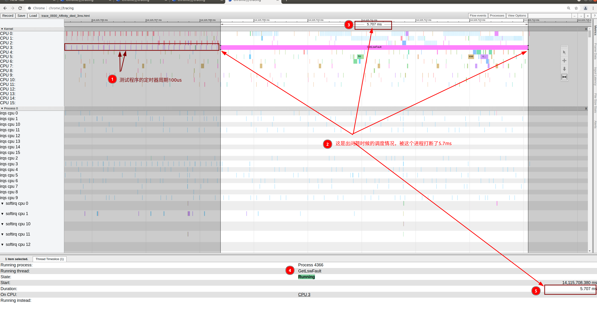
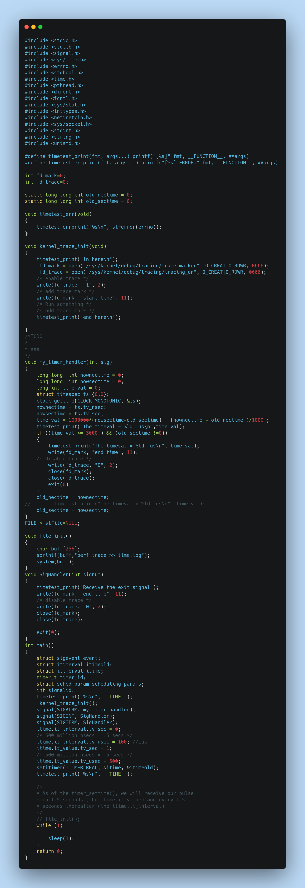
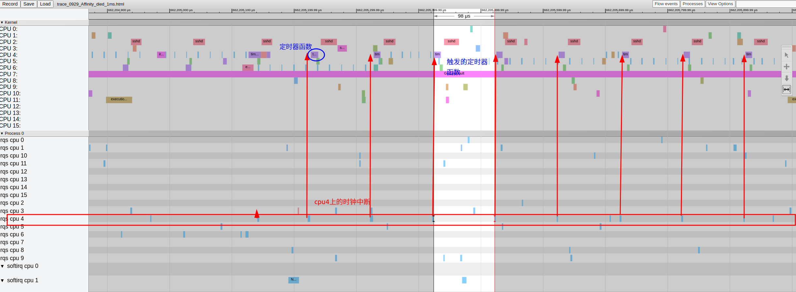
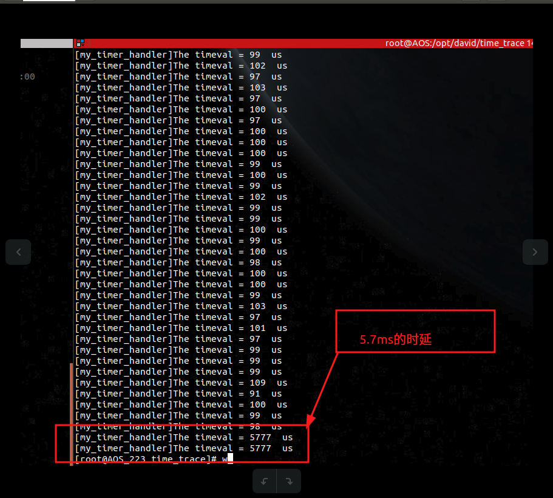
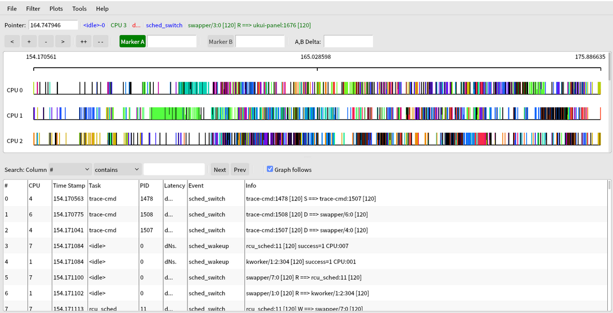
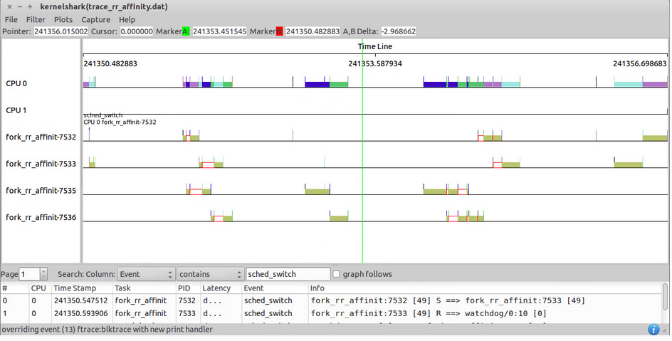
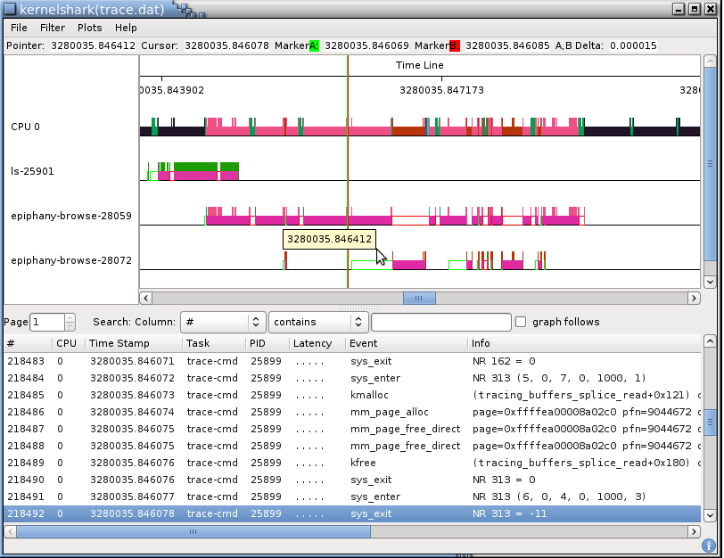
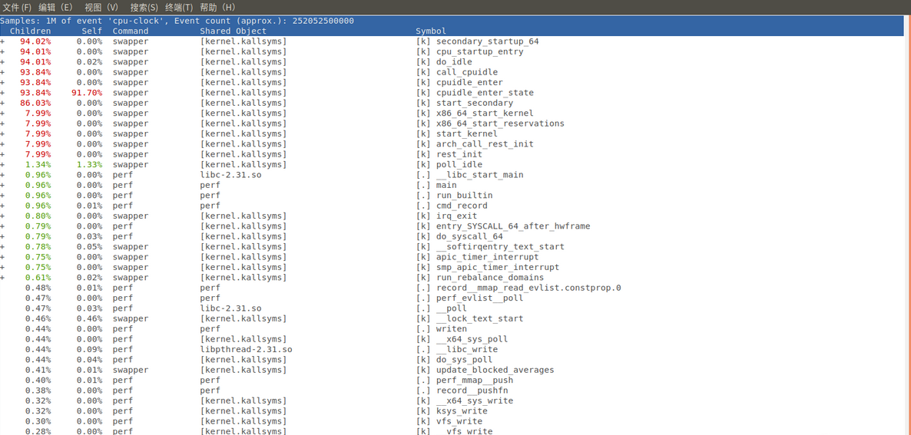

# MDC Kernel Debug总结

郝东东

[toc]


## 1. kernel trace


### 1.1 利用tracing 分析kernel trace

* 打开kernel trace开关以及设置trace缓冲区大小

  * echo 1 > /sys/kernel/debug/tracing/events/irq/enable

  * echo 1 > /sys/kernel/debug/tracing/events/sched/enable

  * echo 10240 > /sys/kernel/debug/tracing/buffer_size_kb

  * echo 1 > /sys/kernel/debug/tracing/options/record-tgid

  * echo 1280 > /sys/kernel/debug/tracing/saved_cmdlines_size

    

* 代码里设置开启记录trace和停止记录trace的时机

  

  * 打开句柄

    

    ``` c
    	int fd_mark = open("/sys/kernel/debug/tracing/trace_marker", O_CREAT|O_RDWR, 0666); 
    	int fd_trace = open("/sys/kernel/debug/tracing/tracing_on", O_CREAT|O_RDWR, 0666); 
    ```

    

  * 设置开始记录触发点

    

    ``` c
    	write(fd_trace, "1", 2); 
    	/* add trace mark */
    	write(fd_mark, "start time", 11); 
    ```

    

  * 结束记录

    ``` c
    	write(fd_mark, "end time", 11);
    	/* disable trace */ 
    	write(fd_trace, "0", 2); 
    	close(fd_mark); 
    	close(fd_trace)
    ```

  

* 导出kernel trace信息为.html格式

  * cat /sys/kernel/debug/tracing/trace > trace.html 

    

* 利用浏览器插件tracing分析trace信息,google或者Edge浏览器中输入:   **chrome://tracing/ ** 

  



### 1.2 一个分析trace的例子


#### 1.2.1 demo代码





#### 1.2.2 demo介绍

> 该程序实现一个100us定时器，定时器函数会判定每两次进入的时间间隔，正常间隔都是100us,如果超过1ms,就触发停止记录trace,程序退出


#### 1.2.3 分析trace


* 正常情况下，可以看出cpu4上的软中断每100us触发一次测试demo程序





* 异常情况，可以看到测试demo程序延迟了5.7ms

  

  

  

  


## 2 利用kernelshark进行分析


### 2.1 ubuntu下安装kernelshark


* ```shell
  sudo apt install trace-cmd keenelshark
  ```


### 2.2 使用trace-cmd 生成trace.dat


* ```shell
  sudo trace-cmd record -e 'sched_wakeup*' -e sched_switch -e 'sched_migrate*'
  ```


### 2.3 使用kernelshark加载.dat文件并分析











### 2.4. trace-cmd

> 更多利用trcae-cmd用法可以查阅相关官网进行调试


## 3. perf工具


### 3.1 perf使用举例


* perf top: 查看实时信息
* perf list: 列出所有支持perf的事件
* perf stat: 统计进程各种信息
* perf record:统计结果




## 4. kernel调试网址


* [kernel调试](https://www.kernel.org/doc/html/v4.18/trace/index.html)

