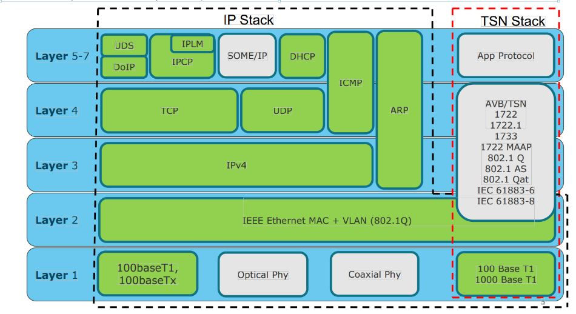
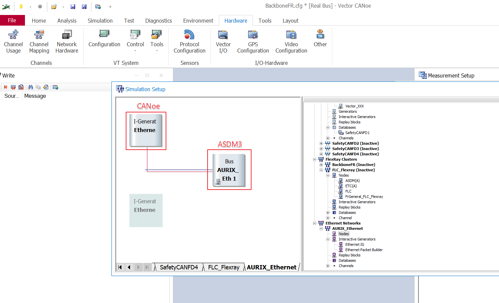
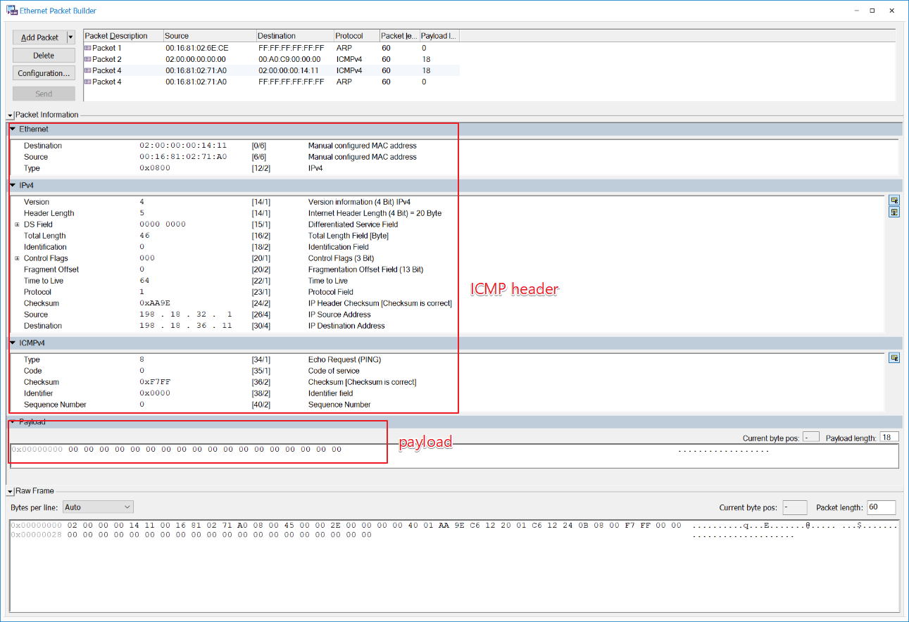
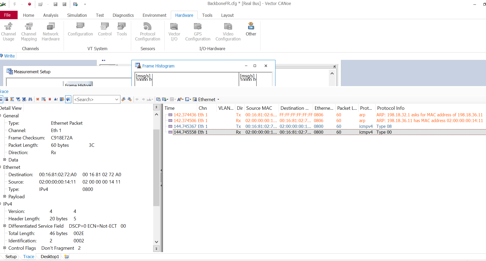

= Ethernet specification
:toc:
:toclevels: 4
:toc-position: left
:source-highlighter: pygments
:icons: font
:sectnums:

== TERMINOLOGY

* __#MAC#__       Media Access Control
* __#ARP#__       Address Resolution Protocol
* __#IP#__         Internet Protocol
* __#ICMP#__       Media Access Control
* __#VLAN#__       Virtual Local Area Network
* __#UDP#__        User Datagram protocol
* __#TCP#__        Transmission Control Protocol
* __#IPCP#__       Ip Command protocol
* __#IPLM#__       Ip link Mananger

== Ethernet protocol list

* Layer 2
** ARP
** VLAN
* Layer 3
** ICMP
* Layer 4
** UDP
** UDP socket<use for IPCp and IPLM>
* Layer 5
** IPCP
** IPLM

== ARP

=== introduce

The Address Resolution Protocol (ARP) is a communication protocol used for
discovering the link layer address, such as a MAC address, associated with a
given internet layer address, typically an IPv4 address. This mapping is a
critical function in the Internet protocol suite.
ARP was defined in 1982 by RFC 826,which is Internet Standard STD 37.

=== Operating scope

The Address Resolution Protocol is a request-response protocol whose messages
are encapsulated by a link layer protocol. It is communicated within the
boundaries of a single network, never routed across internetworking nodes.
This property places ARP into the link layer of the Internet protocol suite

=== Message

* Arp request. The Ip address of ASDM is 192.18.36.1/255.255.0.0
 The MAC address of ASDM is 02:00:00:00:14:01

* Internet Protocol (IPv4) over Ethernet ARP packet

image:image/arp.JPG[image,600,600,role="center"]

== VLAN

=== introduce

A virtual LAN (VLAN) is any broadcast domain that is partitioned and isolated in a
computer network at the data link layer (OSI layer 2)

The protocol most commonly used today to support VLANs is IEEE 802.1Q

=== vlan distribution

,===

vlan ID,node name,function
2,VGM-ASDM,ipcp
5,VGM-ASDM,Traffic Jam Pilot
6,VGM-ASDM,IPLM
12,VGM-ASDM,ICMP

,===
=== Frame format

* 802.1Q tag format

image:image/vlan.JPG[image,600,600,role="center"]

* Frame format

=== Double tagging

* GEELY asked us to discard the Double tagging messages.

* All ECUs (including the switches) shall drop frames with more than one outer VLAN Tag with TPID
0x8100.
* All ECUs (including the switches) shall drop frames with an outer VLAN Tag with TPID 0x9100 or
0x88a8.

== ICMP

=== introduce

The Internet Protocol (IP) is used for host-to-host datagram
service in a system of interconnected networks called the
Catenet

ICMP messages are sent in several situations:  for example, when a
datagram cannot reach its destination, when the gateway does not have
the buffering capacity to forward a datagram, and when the gateway
can direct the host to send traffic on a shorter route.

=== Echo or Echo Reply Message

    0                   1                   2                   3
   0 1 2 3 4 5 6 7 8 9 0 1 2 3 4 5 6 7 8 9 0 1 2 3 4 5 6 7 8 9 0 1
  +-+-+-+-+-+-+-+-+-+-+-+-+-+-+-+-+-+-+-+-+-+-+-+-+-+-+-+-+-+-+-+-+
  |     Type      |     Code      |          Checksum             |
  +-+-+-+-+-+-+-+-+-+-+-+-+-+-+-+-+-+-+-+-+-+-+-+-+-+-+-+-+-+-+-+-+
  |           Identifier          |        Sequence Number        |
  +-+-+-+-+-+-+-+-+-+-+-+-+-+-+-+-+-+-+-+-+-+-+-+-+-+-+-+-+-+-+-+-+
  |     Data ...
  +-+-+-+-+-

* IP Fields:

** Addresses:
    The address of the source in an echo message will be the
    destination of the echo reply message.  To form an echo reply
    message, the source and destination addresses are simply reversed,
    the type code changed to 0, and the checksum recomputed.

* IP Fields:

** Type
*** 8 for echo message
*** 0 for echo reply message
** Code
*** 0
** Checksum
***   The checksum is the 16-bit ones's complement of the one's
      complement sum of the ICMP message starting with the ICMP Type.
      For computing the checksum , the checksum field should be zero.
      If the total length is odd, the received data is padded with one
      octet of zeros for computing the checksum.  This checksum may be
      replaced in the future.
** Identifier
*** If code = 0, an identifier to aid in matching echos and replies,
    may be zero.
** Sequence Number
***  If code = 0, a sequence number to aid in matching echos and
    replies, may be zero
** Description
***  The data received in the echo message must be returned in the echo
     reply message.

      The identifier and sequence number may be used by the echo sender
      to aid in matching the replies with the echo requests.  For
      example, the identifier might be used like a port in TCP or UDP to
      identify a session, and the sequence number might be incremented
      on each echo request sent.  The echoer returns these same values
      in the echo reply.

      Code 0 may be received from a gateway or a host.

=== Message formats

ICMP messages are sent using the basic IP header.  The first octet of
the data portion of the datagram is a ICMP type field; the value of
this field determines the format of the remaining data.  Any field
labeled "unused" is reserved for later extensions and must be zero
when sent, but receivers should not use these fields (except to
include them in the checksum).

== IPCP

=== introduce

=== Protocol Header Overview

image:image/ipcp1.JPG[image,600,600,role="center"]

=== message list

,===
Unique Identifier(16 bit),operationID name
0x0001,GlobalDataMessage
0x0002,PathControlMessage
0x0003,PositionMessage
0x0004,ProfileMessage
0x0005,ProfileControlMessage
,===

== IPLM

=== introduce

=== Protocol Header Overview

image:image/ipcp2.JPG[image,600,600,role="center"]

== example for test ARP/ICMP

=== Tools

* Vector VN5610A
* ASDM boards
* PC
* power supply

=== Connection

image:image/test0.JPG[image,600,600,role="center"]

=== test step

* Open the software for VN5610A,Power on the ASDM3

* Config VN5610A and send A arp packet

image:image/test2.png[image,600,800,role="center"]

* config the VN5610A and send a icmp packet

=== test result

* The VN5610A receive the arp reply from ASDM

image:image/test4.png[image,600,800,role="center"]

* The VN5610A receive the icmp reply from ASDM

