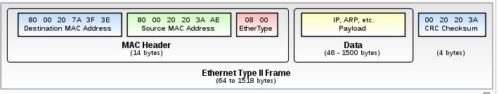
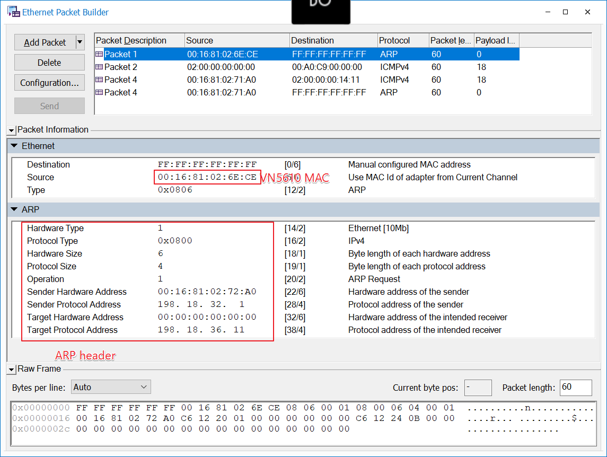

= Ethernet specification
:toc:
:toclevels: 4
:toc-position: left
:source-highlighter: pygments
:icons: font
:sectnums:

== TERMINOLOGY

*  **MAC**      : Media Access Control
*  **ARP**       : Address Resolution Protocol
*  **IP**         : Internet Protocol
*  **ICMP**      :  Media Access Control
*  **VLAN**      : Virtual Local Area Network
*  **UDP**        : User Datagram protocol
*  **TCP**       : Transmission Control Protocol
*  **IPCP**       : Ip Command protocol
*  **IPLM**       : Ip link Mananger

== Ethernet protocol list

* Layer 2
** ARP
** VLAN
* Layer 3
** ICMP
* Layer 4
** UDP
** UDP socket<use for IPCp and IPLM>
* Layer 5
** IPCP
** IPLM

== MAC_HEADER

Every Ethernet network interface card (NIC) is given a unique identifier called a MAC address. This is assigned by the manufacturer of
the card and each manufacturer that complies with IEEE standards can apply to the IEEE Registration Authority for a range of numbers for
use in its products.

=== introduce

The header features destination and source MAC addresses (each six octets in length),
the EtherType field and, optionally, an IEEE 802.1Q tag or IEEE 802.1ad tag

=== format introduce

* destination MAC Address

** The destination MAC Address has 6 bytes .

** This field contains the address of station for which the data is intended.
The left most bit indicates whether the destination is an individual address or
a group address. An individual address is denoted by a zero, while a one indicates a group address.
The next bit into the DA indicates whether the address is globally administered, or local. If the address
is globally administered the bit is a zero, and a one of it is locally administered. There are then 46 remaining bits.
These are used for the destination address itself.

** For our project,The destination MAC Address is 02:00:00:00:14:01

* Source MAC Address
** The source address consists of six bytes, and it is used to identify the sending station.
As it is always an individual address the left most bit is always a zero.

* Length/Type

**  This field is two bytes in length. It provides MAC information and indicates
the number of client data types that are contained in the data field of the frame.
It may also indicate the frame ID type if the frame is assembled using an optional
format.(IEEE 802.3 only).

** For our project, we use the ipv4 procotol and 8021q procotol
*** if the procotol is IPV4,The value of this field should be 0x0800
*** if the procotol is VLAN(8021q),The value of this field should be 0x8100

== ARP

=== introduce

The Address Resolution Protocol (ARP) is a communication protocol used for
discovering the link layer address, such as a MAC address, associated with a
given internet layer address, typically an IPv4 address. This mapping is a
critical function in the Internet protocol suite.
ARP was defined in 1982 by RFC 826,which is Internet Standard STD 37.

=== Operating scope

The Address Resolution Protocol is a request-response protocol whose messages
are encapsulated by a link layer protocol. It is communicated within the
boundaries of a single network, never routed across internetworking nodes.
This property places ARP into the link layer of the Internet protocol suite

=== Message

* Arp request. The Ip address of ASDM is 198.18.36.1/255.255.0.0
 The MAC address of ASDM is 02:00:00:00:14:01

* Internet Protocol (IPv4) over Ethernet ARP packet

image:image/arp.JPG[image,600,600,role="center"]

=== format introduce

* Hardware type (HTYPE)
** This field specifies the network link protocol type.
   Example: Ethernet is 1.
* Protocol type (PTYPE)
** This field specifies the internetwork protocol for which the ARP request is intended.
  For IPv4, this has the value 0x0800.
* Hardware length (HLEN)
** Length (in octets) of a hardware address. Ethernet addresses size is 6
* Protocol length (PLEN)
** Length (in octets) of addresses used in the upper layer protocol. (The upper layer protocol specified in PTYPE.) IPv4 address size is 4.
* Operation
** Specifies the operation that the sender is performing: 1 for request, 2 for reply.
* Sender hardware address (SHA)
** Media address of the sender. In an ARP request this field is used to indicate the address of the host sending the request. In an ARP reply this field is used to indicate the address of the host that the request was looking for. (Not necessarily address of the host replying as in the case of virtual media.) Switches do not
 pay attention to this field, particularly in learning MAC addresses. The ARP PDU is encapsulated in Ethernet frame, and that is why Layer 2 devices examine it.
* Sender protocol address (SPA)
** Internetwork address of the sender.
* Target hardware address (THA)
** Media address of the intended receiver. In an ARP request this field is ignored.
 In an ARP reply this field is used to indicate the address of the host that originated the ARP request.

* Target protocol address (TPA)
** Internetwork address of the intended receiver

=== example of arp packet

== VLAN

=== introduce

A virtual LAN (VLAN) is any broadcast domain that is partitioned and isolated in a
computer network at the data link layer (OSI layer 2)

The protocol most commonly used today to support VLANs is IEEE 802.1Q

=== vlan distribution

,===

vlan ID,node name,function
2,VGM-ASDM,ipcp
5,VGM-ASDM,Traffic Jam Pilot
6,VGM-ASDM,IPLM
12,VGM-ASDM,ICMP

,===
=== Frame format

* 802.1Q tag format

* format introduce

** Tag protocol identifier (TPID)
*** A 16-bit field set to a value of 0x8100 in order to identify the frame as an IEEE 802.1Q-tagged frame.
This field is located at the same position as the EtherType field in untagged frames, and is thus used
to distinguish the frame from untagged frames.

** Tag control information (TCI)
A 16-bit field containing the following sub-fields:
*** Priority code point (PCP)
**** A 3-bit field which refers to the IEEE 802.1p class of service and maps to the frame priority level.
 Different PCP values can be used to prioritize different classes of traffic
*** Drop eligible indicator (DEI)
**** A 1-bit field. (formerly CFI[b]) May be used separately or in conjunction with PCP to
indicate frames eligible to be dropped in the presence of congestion
*** VLAN identifier (VID)
**** A 12-bit field specifying the VLAN to which the frame belongs. The hexadecimal values of 0x000 and 0xFFF are reserved.
**** For our project,The VID will be config 2,5,6,12
* Frame format

image:image/vlan1.JPG[image,600,600,role="center"]

=== Double tagging

* GEELY asked us to discard the Double tagging messages.

* All ECUs (including the switches) shall drop frames with more than one outer VLAN Tag with TPID
0x8100.
* All ECUs (including the switches) shall drop frames with an outer VLAN Tag with TPID 0x9100 or
0x88a8.

image:image/vlan3.JPG[image,600,600,role="center"]

== ICMP

=== introduce

The Internet Protocol (IP) is used for host-to-host datagram
service in a system of interconnected networks called the
Catenet

ICMP messages are sent in several situations:  for example, when a
datagram cannot reach its destination, when the gateway does not have
the buffering capacity to forward a datagram, and when the gateway
can direct the host to send traffic on a shorter route.

=== Ip address of ASDM

The Ip address of ASDM is 192.18.36.1/255.255.0.0

=== Echo or Echo Reply Message

    0                   1                   2                   3
   0 1 2 3 4 5 6 7 8 9 0 1 2 3 4 5 6 7 8 9 0 1 2 3 4 5 6 7 8 9 0 1
  +-+-+-+-+-+-+-+-+-+-+-+-+-+-+-+-+-+-+-+-+-+-+-+-+-+-+-+-+-+-+-+-+
  |     Type      |     Code      |          Checksum             |
  +-+-+-+-+-+-+-+-+-+-+-+-+-+-+-+-+-+-+-+-+-+-+-+-+-+-+-+-+-+-+-+-+
  |           Identifier          |        Sequence Number        |
  +-+-+-+-+-+-+-+-+-+-+-+-+-+-+-+-+-+-+-+-+-+-+-+-+-+-+-+-+-+-+-+-+
  |     Data ...
  +-+-+-+-+-

* IP Fields:

** Addresses:
    The address of the source in an echo message will be the
    destination of the echo reply message.  To form an echo reply
    message, the source and destination addresses are simply reversed,
    the type code changed to 0, and the checksum recomputed.

* IP Fields:

** Type
*** 8 for echo message
*** 0 for echo reply message
** Code
*** 0
** Checksum
***   The checksum is the 16-bit ones's complement of the one's
      complement sum of the ICMP message starting with the ICMP Type.
      For computing the checksum , the checksum field should be zero.
      If the total length is odd, the received data is padded with one
      octet of zeros for computing the checksum.  This checksum may be
      replaced in the future.
** Identifier
*** If code = 0, an identifier to aid in matching echos and replies,
    may be zero.
** Sequence Number
***  If code = 0, a sequence number to aid in matching echos and
    replies, may be zero
** Description
***  The data received in the echo message must be returned in the echo
     reply message.

      The identifier and sequence number may be used by the echo sender
      to aid in matching the replies with the echo requests.  For
      example, the identifier might be used like a port in TCP or UDP to
      identify a session, and the sequence number might be incremented
      on each echo request sent.  The echoer returns these same values
      in the echo reply.

      Code 0 may be received from a gateway or a host.

=== Message formats

ICMP messages are sent using the basic IP header.  The first octet of
the data portion of the datagram is a ICMP type field; the value of
this field determines the format of the remaining data.  Any field
labeled "unused" is reserved for later extensions and must be zero
when sent, but receivers should not use these fields (except to
include them in the checksum).

== IPCP

=== introduce

image:image/ipcp.JPG[image,600,600,role="center"]

=== Protocol Header Overview

=== message list

,===
Unique Identifier(16 bit),operationID name
0x0001,GlobalDataMessage
0x0002,PathControlMessage
0x0003,PositionMessage
0x0004,ProfileMessage
0x0005,ProfileControlMessage
,===

=== implementation

TIP: IPCP requires a script to emulate the IHU server and I think this could be done
     by Sarvesh

== IPLM

=== introduce

image:image/ipcp.JPG[image,600,600,role="center"]

=== Protocol Header Overview

=== implementation

TIP: IPLM requires a script to emulate the IHU server and I think this could be done
     by Sarvesh

== example for test ARP/ICMP

=== Tools

* Vector VN5610A
* ASDM boards
* PC
* power supply

=== Connection

image:image/test0.JPG[image,600,600,role="center"]

=== test step

* Open the software for VN5610A,Power on the ASDM3

image:image/test1.png[image,600,800,role="center"]

* Config VN5610A and send A arp packet

* config the VN5610A and send a icmp packet

image:image/test3.png[image,600,800,role="center"]

=== test result

* The VN5610A receive the arp reply from ASDM

image:image/test4.png[image,600,800,role="center"]

* The VN5610A receive the icmp reply from ASDM

image:image/test5.png[image,600,800,role="center"]
