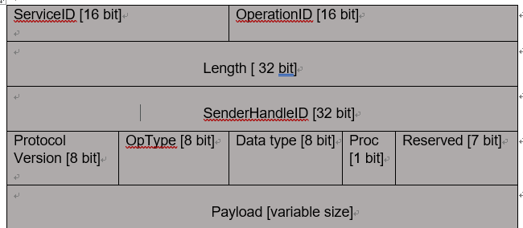

= Ethernet specification
:toc:
:toclevels: 4
:toc-position: left
:source-highlighter: pygments
:icons: font
:sectnums:

== TERMINOLOGY

*  **MAC**      : Media Access Control
*  **ARP**       : Address Resolution Protocol
*  **IP**         : Internet Protocol
*  **ICMP**      :  Media Access Control
*  **VLAN**      : Virtual Local Area Network
*  **UDP**        : User Datagram protocol
*  **TCP**       : Transmission Control Protocol
*  **IPCP**       : Ip Command protocol

== Ethernet protocol list

* Layer 2
** ARP
** VLAN
* Layer 5
** ICMP
** IPCP

== MAC_HEADER

Every Ethernet network interface card (NIC) is given a unique identifier called a MAC address. This is assigned by the manufacturer of
the card and each manufacturer that complies with IEEE standards can apply to the IEEE Registration Authority for a range of numbers for
use in its products.

=== introduce

The header features destination and source MAC addresses (each six octets in length),
the EtherType field and, optionally, an IEEE 802.1Q tag or IEEE 802.1ad tag

image:image/Ether.JPG[image,600,600,role="center"]

=== format introduce

* destination MAC Address

** The destination MAC Address has 6 bytes .

** This field contains the address of station for which the data is intended.
The left most bit indicates whether the destination is an individual address or
a group address. An individual address is denoted by a zero, while a one indicates a group address.
The next bit into the DA indicates whether the address is globally administered, or local. If the address
is globally administered the bit is a zero, and a one of it is locally administered. There are then 46 remaining bits.
These are used for the destination address itself.

** The ASDM MAC Address is 02:00:00:00:14:01

* Source MAC Address
** The source address consists of six bytes, and it is used to identify the sending station.
As it is always an individual address the left most bit is always a zero.

* Length/Type

**  This field is two bytes in length. It provides MAC information and indicates
the number of client data types that are contained in the data field of the frame.
It may also indicate the frame ID type if the frame is assembled using an optional
format.(IEEE 802.3 only).

** For our project, we use the ipv4 protocol and 8021q protocol
*** if the protocol is IPV4,The value of this field should be 0x0800
*** if the protocol is VLAN(8021q),The value of this field should be 0x8100

== ARP TEST

=== arp introduce

The Address Resolution Protocol (ARP) is a communication protocol used for
discovering the link layer address, such as a MAC address, associated with a
given internet layer address, typically an IPv4 address.

=== purpose

To ensure link communication between ASDM and Chadoc is normal

=== Message

* The Chadoc tool should send ARP request message to ASDM

.According to the requirement

. The Ip address of ASDM is 198.18.36.1
. The MAC address of ASDM is 02:00:00:00:14:01

* Internet Protocol (IPv4) over Ethernet ARP packet

=== Chadoc Test Description

. Prepare for networking as shown below

[start=2]

. Simulate an ARP request message and send to ASDM

.Expected Result
* The Chadoc tool will receive an ARP reply from ASDM
** In the ARP reply message ，The ASDM MAC Address is 02:00:00:00:14:01,IP adress is 198.18.36.1

== VLAN TEST

=== introduce

A virtual LAN (VLAN) is any broadcast domain that is partitioned and isolated in a
computer network at the data link layer (OSI layer 2)

The protocol most commonly used today to support VLANs is IEEE 802.1Q

=== purpose

To ensure that ASDM can receive and sent vlan message.

=== vlan distribution in ASDM

,===

vlan ID,node name,function

5,VGM-ASDM,Traffic Jam Pilot
6,VGM-ASDM,IPLM

,===
=== Chadoc Test Description

.  Simulate an ARP request message with vlan tag 5 (VID set to 5)and send to ASDM

.  Simulate an ARP request message with vlan tag 6 (VID set to 6) and send to ASDM

.This message as shown bleow

.Expected Result
* The ARP reply message could be received by Chadoc
** In the ARP reply message ，The ASDM MAC Address is 02:00:00:00:14:01,IP adress is 198.18.36.1

=== Double tagging test

* Need to check ASDM will discard all the Double tagging messages.

.This message as shown bleow

==== Chadoc Test Description

.  Simulate an ARP request message with double vlan tag 5 and vlan x (x will be between 1 and 4095 value)and send to ASDM

.  Simulate an ARP request message with vlan tag 5 and vlan x (x will be between 1 and 4095 value) and send to ASDM

.Expected Result

* NO message could be received by Chadoc

== ICMP TEST

=== introduce

ICMP messages are sent in several situations:  for example, when a
datagram cannot reach its destination, when the gateway does not have
the buffering capacity to forward a datagram, and when the gateway
can direct the host to send traffic on a shorter route.

=== Ip address of ASDM

.According to the requirement

. The MAC address of ASDM is 02:00:00:00:14:01
. The IP address of ASDM is 198.18.36.1/255.255.0.0

=== Echo Message introduce

    0                   1                   2                   3
   0 1 2 3 4 5 6 7 8 9 0 1 2 3 4 5 6 7 8 9 0 1 2 3 4 5 6 7 8 9 0 1
  +-+-+-+-+-+-+-+-+-+-+-+-+-+-+-+-+-+-+-+-+-+-+-+-+-+-+-+-+-+-+-+-+
  |     Type      |     Code      |          Checksum             |
  +-+-+-+-+-+-+-+-+-+-+-+-+-+-+-+-+-+-+-+-+-+-+-+-+-+-+-+-+-+-+-+-+
  |           Identifier          |        Sequence Number        |
  +-+-+-+-+-+-+-+-+-+-+-+-+-+-+-+-+-+-+-+-+-+-+-+-+-+-+-+-+-+-+-+-+
  |     Data ...
  +-+-+-+-+-

* IP Fields:

** Addresses:
    The address of the source in an echo message will be the
    destination of the echo reply message.  To form an echo reply
    message, the source and destination addresses are simply reversed,
    the type code changed to 0, and the checksum recomputed.

* IP Fields:

** Type
*** 8 for echo message
*** 0 for echo reply message
** Code
*** 0
** Checksum
***   The checksum is the 16-bit ones's complement of the one's
      complement sum of the ICMP message starting with the ICMP Type.
      For computing the checksum , the checksum field should be zero.
      If the total length is odd, the received data is padded with one
      octet of zeros for computing the checksum.  This checksum may be
      replaced in the future.
** Identifier
*** If code = 0, an identifier to aid in matching echos and replies,
    may be zero.
** Sequence Number
***  If code = 0, a sequence number to aid in matching echos and
    replies, may be zero
** Description
***  The data received in the echo message must be returned in the echo
     reply message.

      The identifier and sequence number may be used by the echo sender
      to aid in matching the replies with the echo requests.  For
      example, the identifier might be used like a port in TCP or UDP to
      identify a session, and the sequence number might be incremented
      on each echo request sent.  The echoer returns these same values
      in the echo reply.

      Code 0 may be received from a gateway or a host.

=== Chadoc Test Description

. Prepare for networking as shown below

[start=2]
. Simulate an ARP request message and sent to ASDM
. Simulate an ICMP request message (destination IP address set to 198.18.36.1) to ASDM

.This message as shown bleow

.Expected Result

. For step 2,The Chadoc tool will receive an ARP reply message from ASDM
. For step 3,The Chadoc tool will receive a ICMP reply message from ASDM

== IPCP TEST

=== introduce

image:image/ipcp.JPG[image,600,600,role="center"]

* IPCP use udp protocol and udp port is 50174

=== IPCP Header Overview

===  IPCP NOTIFICATION MESSAGE

* ServiceID = 0xAE
* OperationID = 0x0001
* Length = (According to the actual data length)
* SenderHandleID = 0xAE010501
* Protocol Version = 0x03
* OpType = 0X05
* DataType = 0x01
* Proc/Reserved = 0x00

=== Chadoc Test Description

. Prepare for networking as shown below

[start=2]
. power up the ASDM
. Chadoc tool send an IPCP NOTIFICATION  meaasge to ASDM with vlan 5

[start=3]
. repeat step 2

.Expected Result

. For step 2,The Chadoc tool will receive an IPCP SETREQUEST_NORETURN message from ASDM
. For step 3,The Chadoc tool will receive an IPCP ACK  message from ASDM

== example for test ARP/ICMP

=== Tools

* Vector VN5610A
* ASDM boards
* PC
* power supply

=== Connection

=== test step

* Open the software for VN5610A,Power on the ASDM3

image:image/test1.png[image,600,800,role="center"]

* Config VN5610A and send A arp packet

image:image/test2.png[image,600,800,role="center"]

* config the VN5610A and send a icmp packet

image:image/test3.png[image,600,800,role="center"]

=== test result

* The VN5610A receive the arp reply from ASDM

* The VN5610A receive the icmp reply from ASDM

image:image/test5.png[image,600,800,role="center"]
