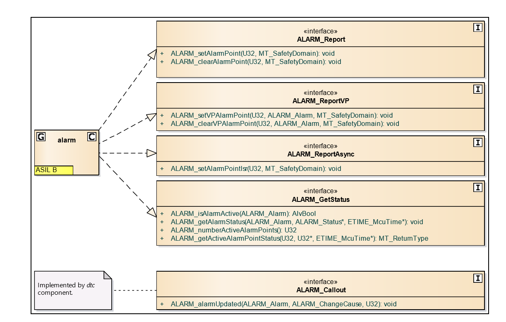

= alarm模块学习
郝东东
:toc:
:toclevels: 4
:toc-position: left
:source-highlighter: pygments
:icons: font
:sectnums:

== Alarm模块目的

* Alarm模块位于Support中，有以下几个目的
** 提供统一的接口给各个模块，用于触发一个alarm或者获取一个alarm
** 提供统一的方式去reporting the errors
** 存储All errors in ECU
** 提供统一的方式读取errors

== Alarm模块提供接口介绍

* Alarm模块对外提供的接口，可见下图所示

* 接口介绍
** **__#ALARM_Report#__** 系列
*** __#ALARM_setAlarmPoint#__ , Activates the provided MCU AP. A call to the function has no effect for an active AP.
    If the function is called from a domain that is lower than the classification of the AP then the AP is not activated.
    To indicate the error, a system specific alarm is activated. This alarm cannot be deactivated.
*** __#ALARM_clearAlarmPoint#__,Deactivates the provided MCU AP. A call to the function has no effect for an inactive AP.
   If the function is called from a domain that is lower than the classification of the AP then the AP is not deactivated.
   To indicate the error, a system specific alarm is activated. This alarm cannot be deactivated. If a non-configured AP is
   provided (including 0) then a system specific alarm is set and no AP is deactivated
** **__#ALARM_ReportVP#__**系列
***  __#ALARM_setVPAlarmPoint#__,Activates the provided VP AP. A call to the function has no effect for an active AP.
   Besides the alarm point ID, the associated alarm ID is also sent in as a parameter, and is used to trigger the correct
   alarm. The parameter safetyDomain is the safety domain of the VP(x) alarm forwarder component that sent the request to MCU.
   The function activates the AP (unless already active), and consequently activates the alarm (unless already active).
   If safetyDomain is ASIL-B, then the function marks this AP as ASIL-B, ensuring no QM VP alarm forwarder can deactivate
   this AP
*** __#ALARM_clearVPAlarmPoint#__,Deactivates the provided VP AP. A call to the function has no effect for an inactive AP.
  Besides the alarm point ID, the associated alarm ID is also sent in as a parameter, and is used to clear the correct alarm.
  The parameter safetyDomain is the safety domain of the VP(x) alarm forwarder component that sent the request to MCU.
  If safetyDomain is lower than the safety domain registered to the AP upon activation, the function triggers a system
  specific alarm, which cannot be deactivated. Otherwise, it deactivates the AP (unless already inactive), and checks whether
  the alarm shall be deactivated

** **__#ALARM_ReportAsync#__**
*** __#ALARM_setAlarmPointIsr#__,Adds the provided MCU alarm point to a list of alarm points that are waiting on being activated.
    The function suspends all interrupts while modifying the data structure storing the alarm point requests. If the requested
    alarm point already is in the list then it will not be added again.

** **__#ALARM_GetStatus#__**
*** __#ALARM_isAlarmActive#__,Returns AlvTrue if the alarm is active, AlvFalse otherwise.
*** __#ALARM_getAlarmStatus#__,Returns status information for the requested alarm.
*** __#ALARM_numberActiveAlarmPoints#__,Returns the total number of active alarm numbers.
*** __#ALARM_getActiveAlarmStatus#__,Returns the status for the active alarm points with the provided index. If the index is
  valid MT_OK is returned, MT_NOT_OK otherwise. The value of the return parameters is undefined if MT_NOT_OK is returned.
  Note: Every time an alarm point is activated or deactivated the index to an active alarm point may change

== 模块关联

== jhcjdskc

== 总结
....

以上是自己的一点总结，参考来自书籍，网络，内核文档，内核代码。
当然，毕竟是自己现阶段的理解，也可能对有些概念的阐述存在不当之处。
希望以上的总结对大家有一点的帮助。
....
