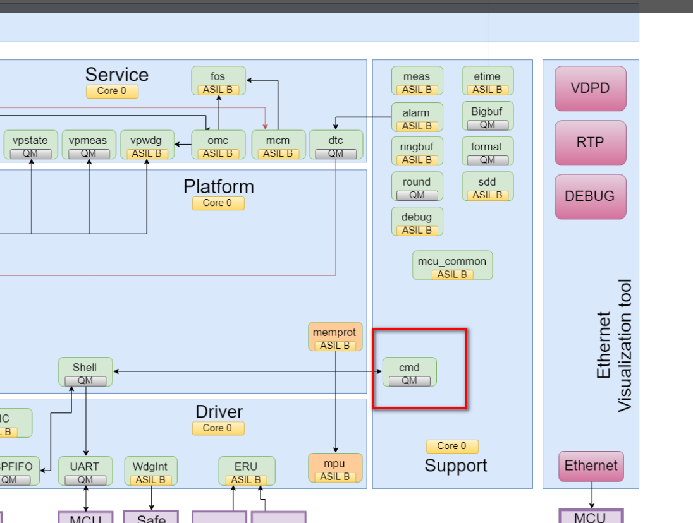
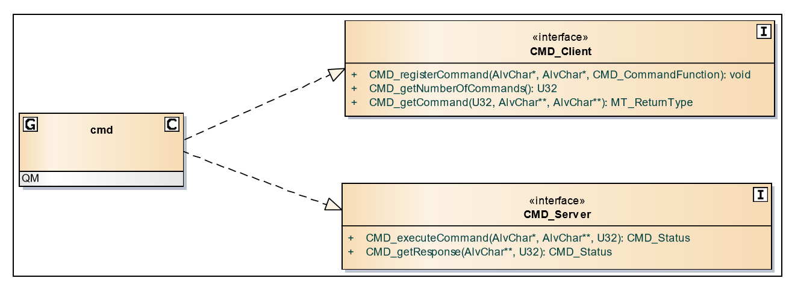
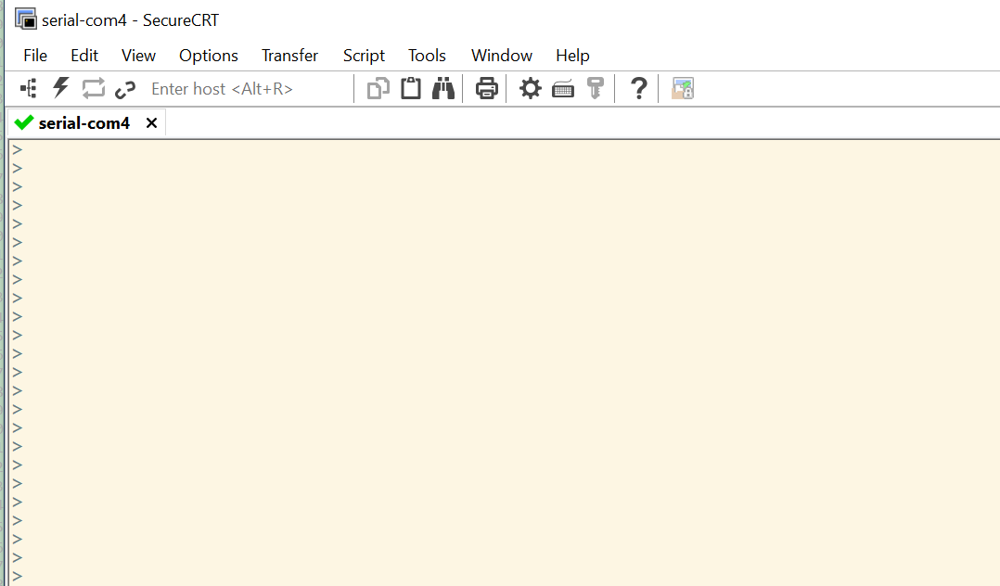
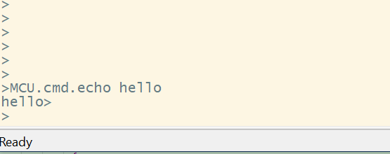
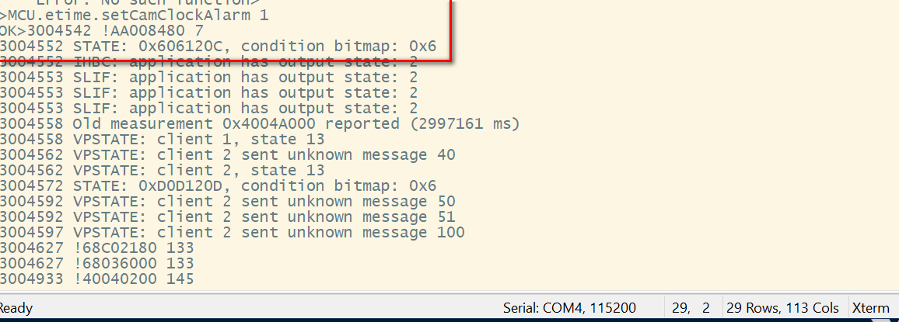
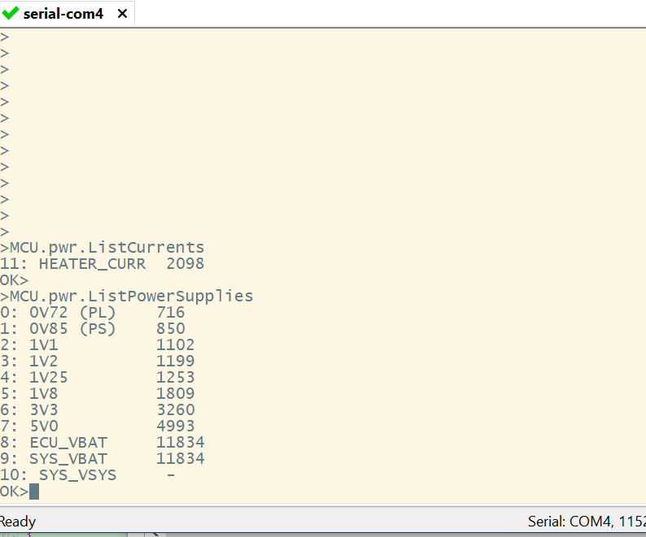
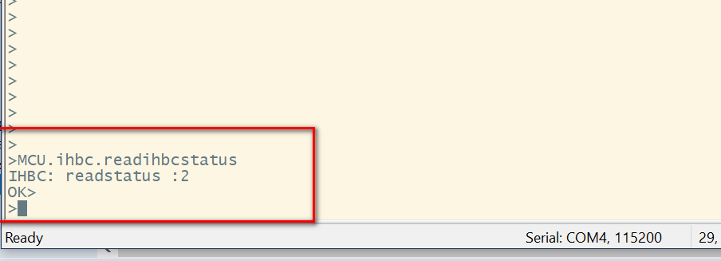

= cmd模块学习
郝东东
:toc:
:toclevels: 4
:toc-position: left
:source-highlighter: pygments
:icons: font
:sectnums:

== Cmd 模块介绍
=== Cmd 模块位置

* Cmd模块位于Platform中,位置图如下

=== Cmd模块目的

* Cmd模块解析命令以及输出命令结果，分两部分
** localCommand:主要是和MCU有关，输入控制MCU有关命令
** remoteCommand:主要是和VP有关，输入控制VP有关命令
** 关系图如下

== sx11串口cmd调试实例

** 连接串口，波特率115200，连接上之后状态如下:

** 调试cmd,输入: #MCU.cmd.echo hello#

** 系统模块串口输出的debug信息

** debug例子，pwr为例，串口下输入 #MCU.pwr.ListCurrents#

== 模块中如何添加串口调试cmd
. 本文以 __#IHBC#__ 为例子，新添加一些串口Debug command.

** 首先，在ihbc模块中调用cmd模块的API来注册一个调试command,API原型如下：

*** #void CMD_registerCommand(const AlvChar* componentName, const AlvChar* command, CMD_CommandFunction const funcPtr)#
**** componentName就是串口命令行 MCU.componentName.command 这样的格式，第三个是一个函数指针，相当于一个回调函数地址。
** 注册函数如下：

[source,c]
static void registerCommands(void)
{
   DEBUG_PRINTF(SHELL_DEBUG_LEVEL_COMMAND, "IHBC: application has register hdd test func %u\n",ihbcStatus);
   CMD_registerCommand("ihbc", "readihbcstatus", &commandReadihbcstatus);
   CMD_registerCommand("ihbc", "writeihbcstatus", &commandWriteihbcstatus);
}

** 然后，把回调函数实体写了就OK了

** 测试ihbc新增加的调试command
*** 进入串口并输入 [red]#MCU.ihbc.readihbcstatus#,就可以得到你自己回调函数的输出结果，见下图:

== 总结

....
以上是自己的一点总结
....
