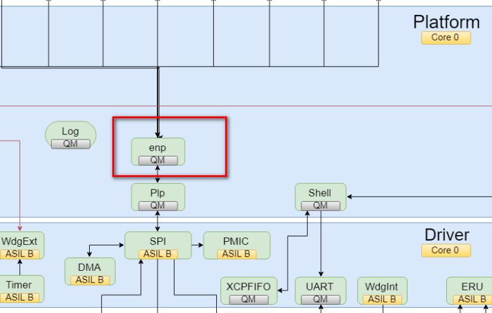
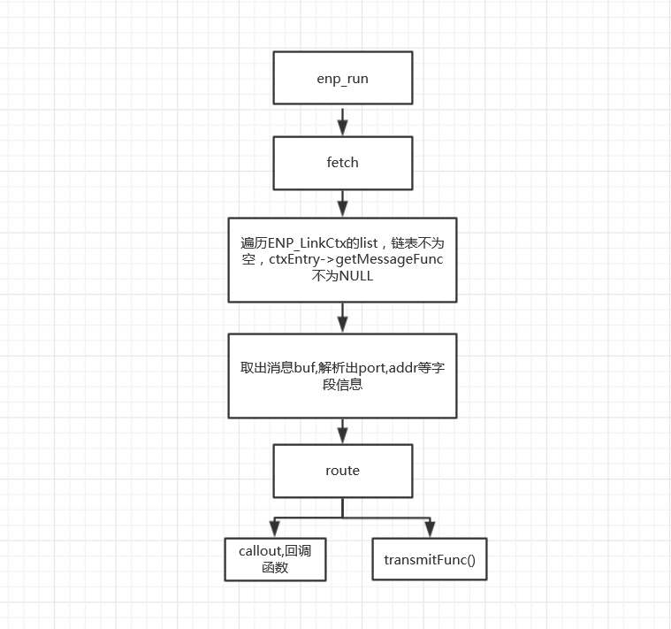
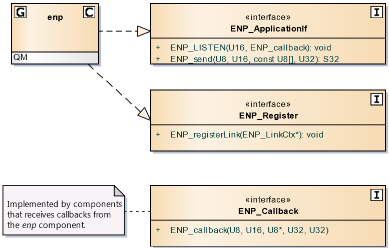
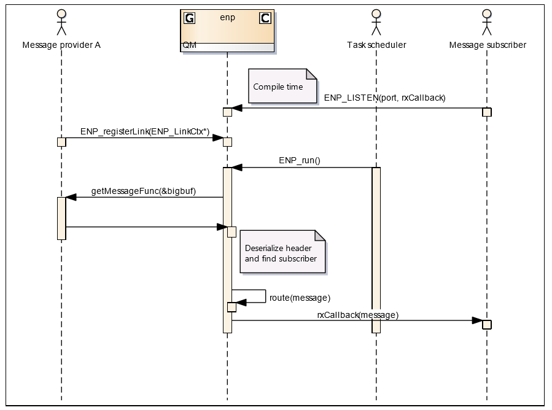
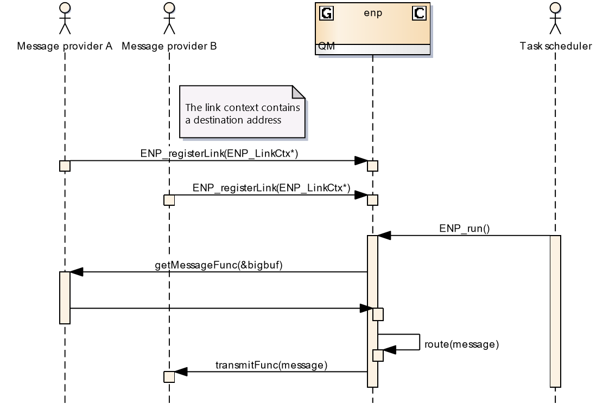
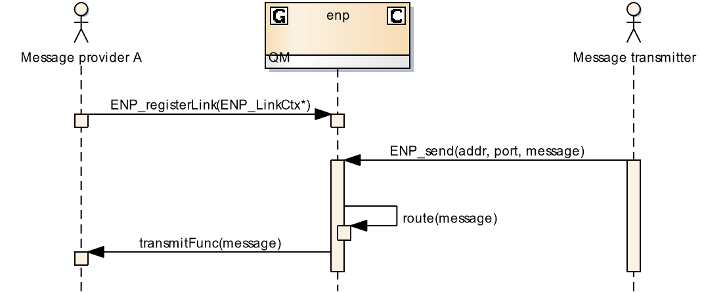

= enp模块学习
郝东东
:toc:
:toclevels: 4
:toc-position: left
:source-highlighter: pygments
:icons: font
:sectnums:

== enp模块位置

* enp模块位于Platform中，主要负责接收VP消息并分发到local模块中

== enp 模块作用

NOTE: enp模块提供了API，用于接收和发送消息，特别是MCU内部模块和VP之间收发消息。

== ENP模块run流程

=== ENP模块run流程

=== ENP模块API

* ENP_LISTEN函数
** 提供给其它模块的API，其它模块可以调用该API注册自己的回调函数，在enp收到vp消息后，
会功能据消息中的port/addr等信息去匹配回调函数，一旦命中，call the callback function.

* ENP_SEND函数
** 用于send the message.可以在MCU内部之间，也可以发给remote vp.

== ENP模块receive the message

== ENP模块send the message

=== local addr

=== 内部发送消息到外部

....
以上是自己的一点总结
....
