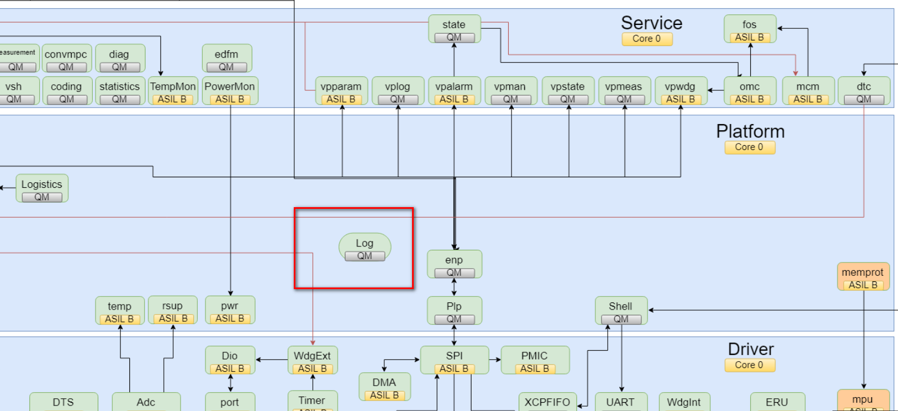
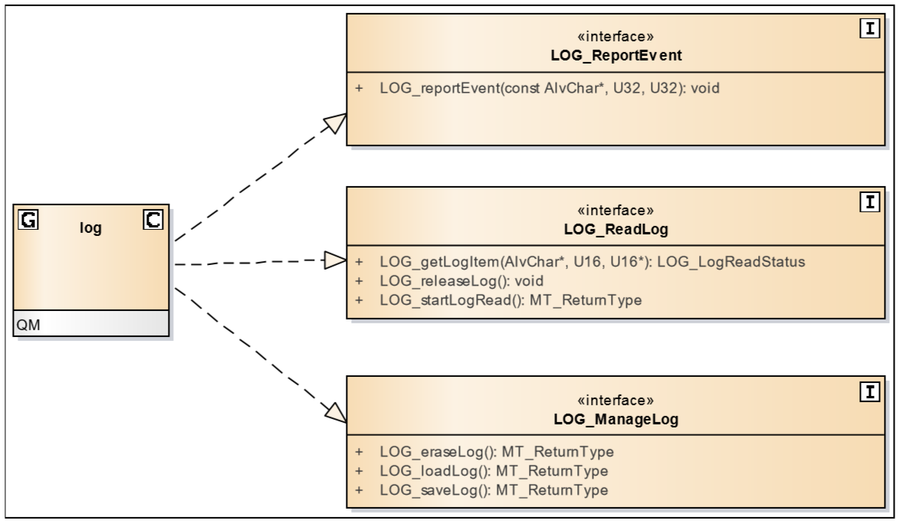
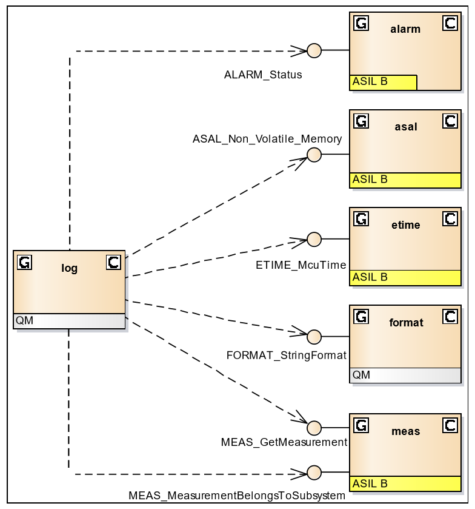

= log模块学习
郝东东
:toc:
:toclevels: 4
:toc-position: left
:source-highlighter: pygments
:icons: font
:sectnums:

== Log模块目的

* Log模块位于Platform中,位置图如下

** recording events and storing them in the MCU event log
** handling the NVM Log
*** 的胸部健康撒谎想不开了撒娇胡闹下

== Log模块提供接口介绍

* Log模块对外提供的接口，可见下图所示

** **__#LOG_reportEvent#__** 系列

*** __#LOG_reportEvent#__ Records the event in the MCU event log if event logging is enabled.

** **__#LOG_ReadLog#__**系列
***  __#LOG_getLogItem#__,Provides the next item from the event log if it is in reading state.
  When the last item is read the event log is automatically released. Returns the status of the attempt:
  OK or OK_LAST on success, ERROR if no items present or if reading beyond the last item is attempted.
*** __#LOG_releaseLog#__,Ends the reading of an event log and reenables the event logging mechanism.
  The function has no effect if the event log is not being read (i.e. the function is always safe to use).
*** __#LOG_startLogRead#__,Resets the read pointer to the beginning of the log. The event logging will
  be inhibited until the event log is released. Returns MT_OK if reading is successfully started,
  MT_NOT_OK otherwise.
** **__#LOG_ManageLog#__** Interface for managing the log from NVM
*** __#LOG_eraseLog#__,Initiates deletion of the NVM block where the
 log was saved. The request will fail if there is any NVM related activity ongoing.
 The success or failure of the operation is reported.

 *** __#LOG_loadLog#__,Load the read buffer with the information found in the NVM block.
  The success or failure of the operation is reported

*** __#LOG_saveLog#__,Initiates storage of the log in NVM. The request will fail if there
  is any NVM related activity ongoing. An ongoing event log read will be stopped (released).
  The success or failure of the operation is reported.

** LOG_startLogReadStatus 返回值状态介绍
*** LOG_STATUS_ERROR (): #The interface was incorrectly used or an error has occurred.#
*** LOG_STATUS_OK(): #A log item was returned#
*** LOG_STATUS_OK_LAST (): #The last log item was returned#
*** LOG_STATUS_WORKING (): #A log item could not be returned at the moment, but there are log items available that can be retrieved at a later point in time.#

== 模块关联

NOTE: 相关模块关系图见下图:

== 总结

....
以上是自己的一点总结
....
