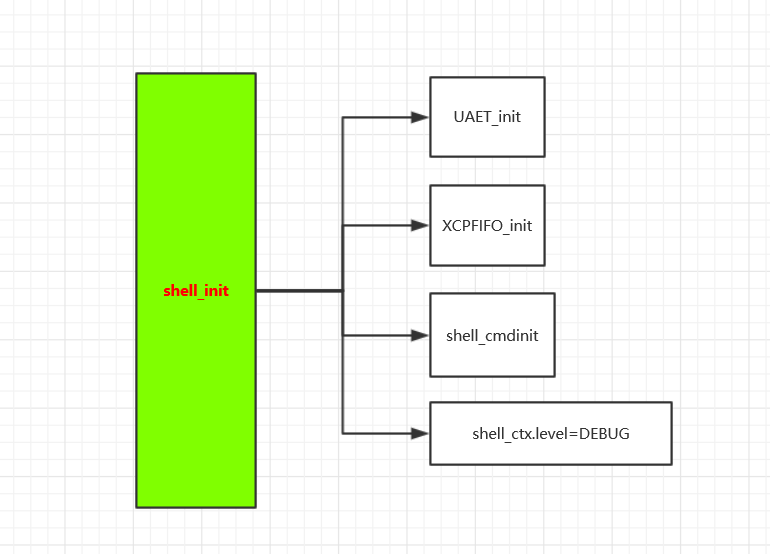

= shell模块学习
郝东东
:toc:
:toclevels: 4
:toc-position: left
:source-highlighter: pygments
:icons: font
:sectnums:

== shell 模块介绍
=== Shell 模块位置

* Cmd模块位于Platform中,位置图如下

image:../image/shell_1.png[image,800,800,role="center"]

=== Shell模块目的

* Shell模块提供输出debug信息，接收用户输入信息并解析，传递给cmd模块

== shell 模块依赖图

== shell模块初始化流程

== shell模块接口

== shell 读取窗口信息流程

....
以上是自己的一点总结
....
