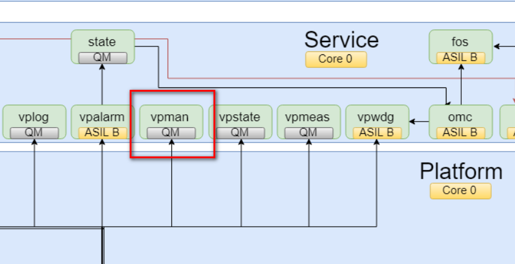
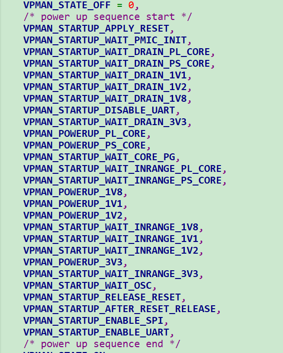
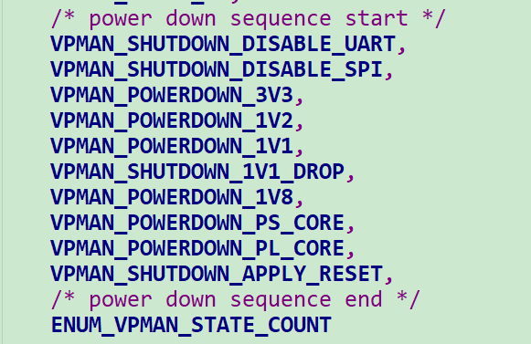
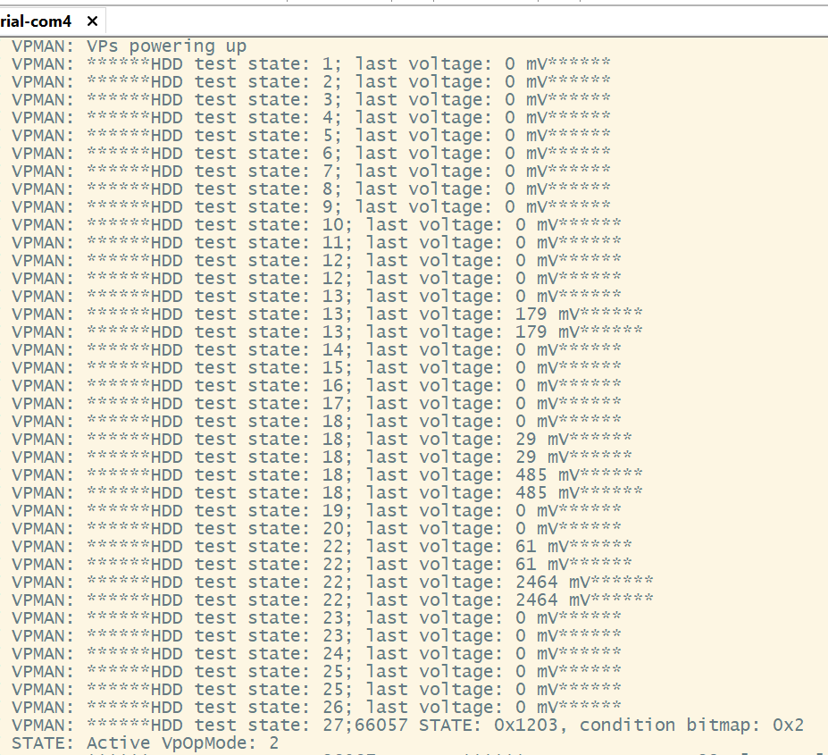
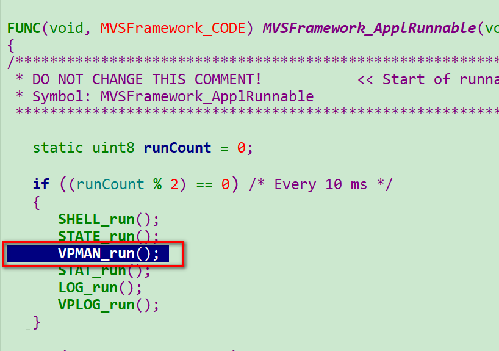
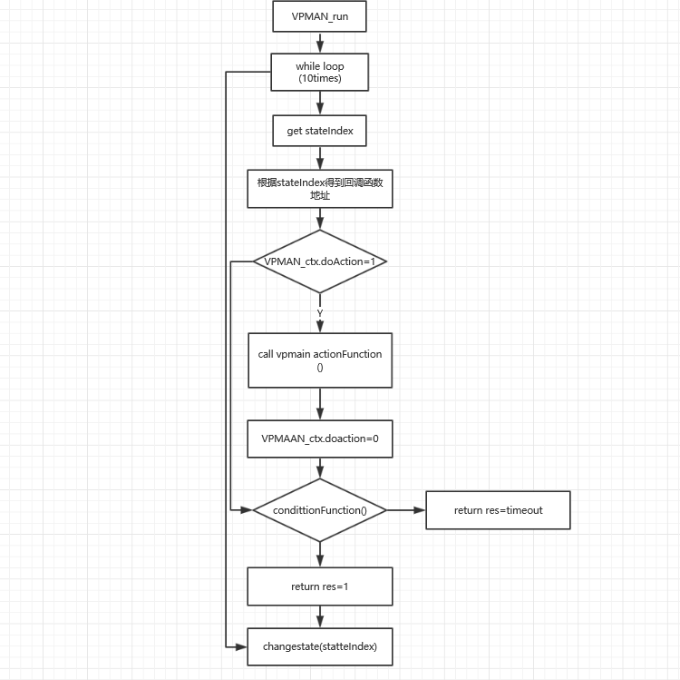

= vpman模块学习
郝东东
:toc:
:toclevels: 4
:toc-position: left
:source-highlighter: pygments
:icons: font
:sectnums:

== vpman模块位置

== vpman模块作用

IMPORTANT: vpman模块管理vp的上电和下电，从而控制AP的启动上电以及断电shutdown

=== VPMAN上电顺序

=== VPMAN下电顺序

=== 串口调试情况

== 模块流程有关

=== 调用逻辑

* 下图可以看出 **__#VPMAN#__** 模块的被调用顺序以及周期(Every 10 ms)

=== vpman模块基本流程图

....
以上是自己的一点总结
....
