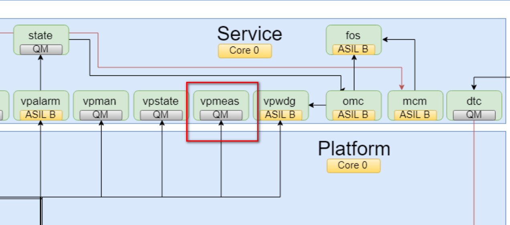

= vpmeas模块学习
郝东东
:toc:
:toclevels: 4
:toc-position: left
:source-highlighter: pygments
:icons: font
:sectnums:

== vpmeas模块位置

== vpman模块作用

IMPORTANT: vpman模块管理vp的上电和下电，从而控制AP的启动上电以及断电shutdown

....
以上是自己的一点总结
....
