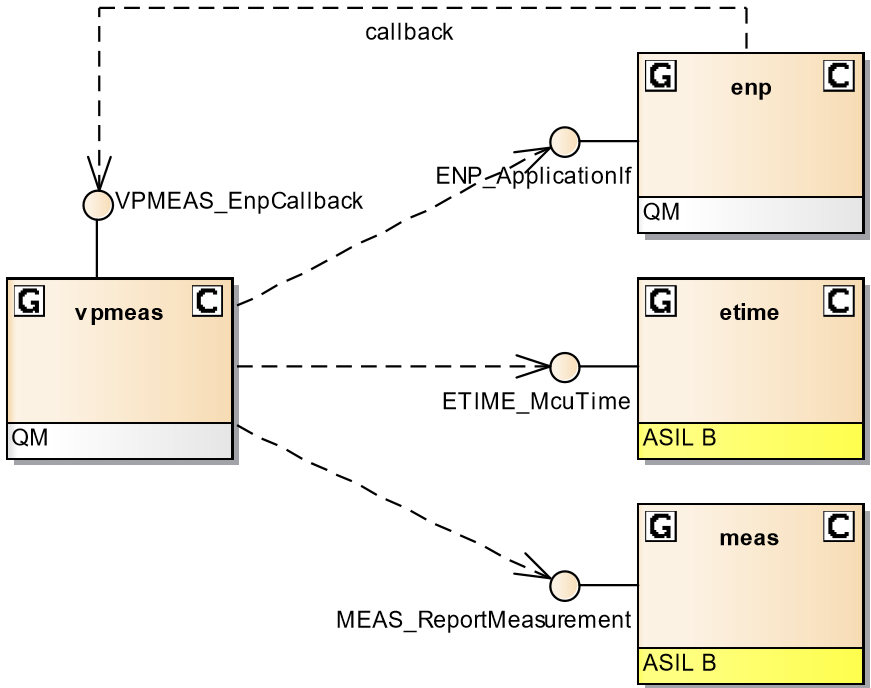

= vpmeas模块学习
郝东东
:toc:
:toclevels: 4
:toc-position: left
:source-highlighter: pygments
:icons: font
:sectnums:

== vpmeas模块位置

image:../image/vpmeas_1.png[image,800,800,role="center"]

== vpman模块概述

IMPORTANT: vpmeas模块主要通过SPI接收VP侧的measurement value,更新后发送给meas模块

=== meas模块有关联的模块

=== 关联API以及作用

* <1> The ENP_ApplicationIf interface of enp to register a callback to a port
* <2> The MEAS_ReportMeasurement interface of meas to update the measurement value
* <3> The ETIME_McuTime interface of etime to get the MCU time

....
以上是自己的一点总结
....
