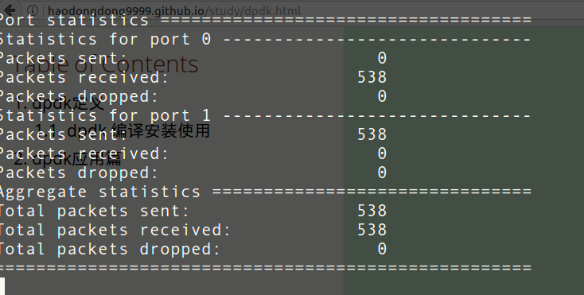
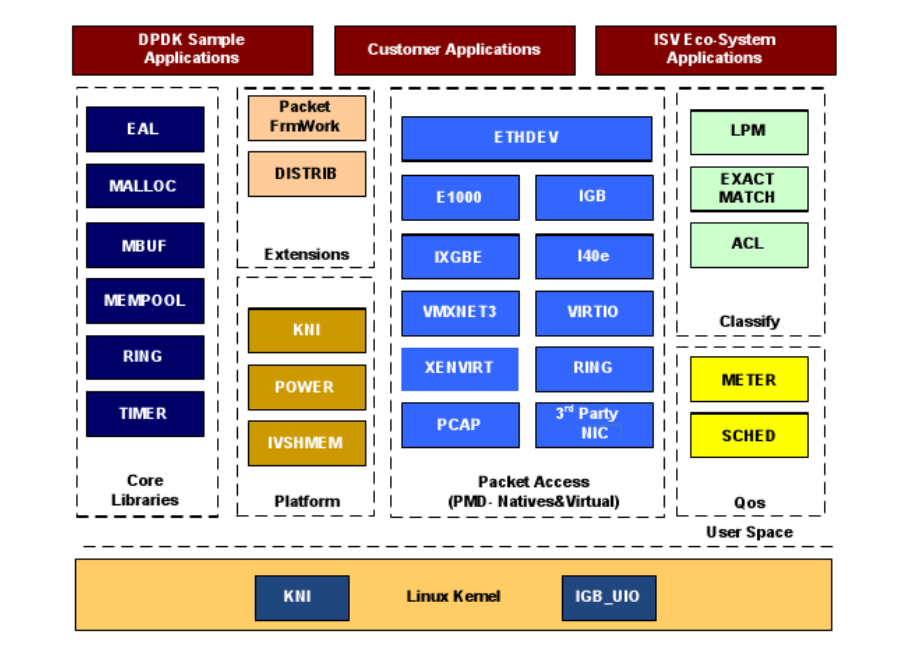
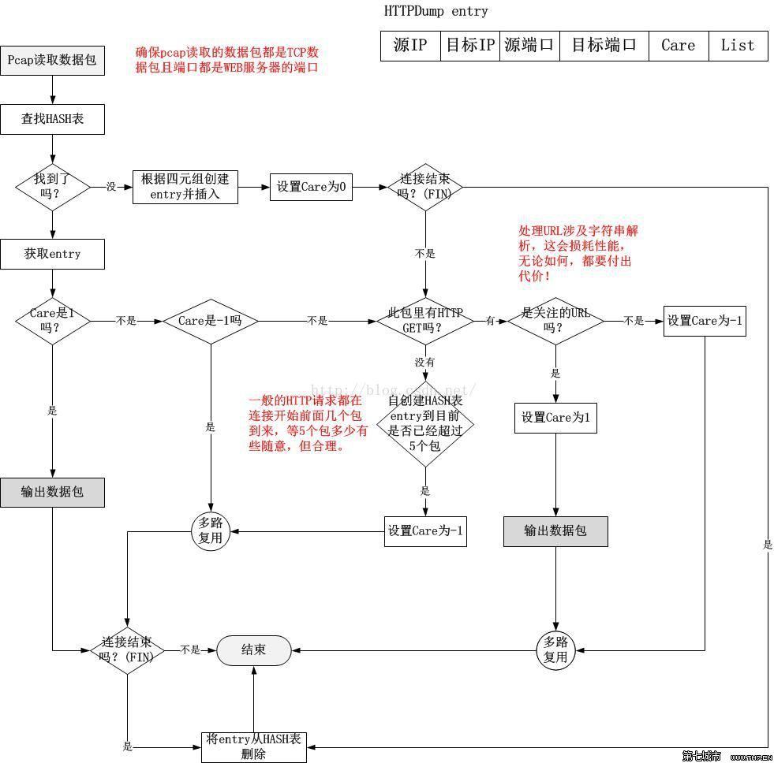

= dpdk技术学习
认真
:toc:
:toclevels: 4
:toc-position: left
:source-highlighter: pygments
:icons: font
:sectnums:

== dpdk定义
[options=interactive]

* dpdk:DPDK(Data Plane Development Kit)，是一组快速处理数据包的开发平台及接口

** 在X86结构中，处理数据包的传统方式是CPU中断方式，既网卡驱动接收到数据包后通过中断通知CPU处理，然后由CPU拷贝数据并交给协议栈。在数据量大时，这种方式会产生大量CPU中断，导致CPU无法运行其他程序。而DPDK则采用轮询方式实现数据包处理过程：DPDK重载了网卡驱动，该驱动在收到数据包后不中断通知CPU，而是将数据包通过零拷贝技术存入内存，这时应用层程序就可以通过DPDK提供的接口，直接从内存读取数据包。这种处理方式节省了CPU中断时间、内存拷贝时间，并向应用层提供了简单易行且高效的数据包处理方式，使得网络应用的开发更加方便。但同时，由于需要重载网卡驱动，因此该开发包目前只能用在部分采用Intel网络处理芯片的网卡中。

=== dpdk 编译安装使用

TIP: 官网地址： link:http://www.dpdk.org[dpdk官网]
中文说明文档地址: link:http://www.mamicode.com/info-detail-1728647.html[中文介绍]
入门手册: link:http://www.mamicode.com/info-detail-1728647.html[入门手册]

* 首先要确认一下设备网卡驱动是否在dpdk支持列表中，具体可以看官方的文档有支持列表

* 下载DPDK版本，在这里 link:http://www.dpdk.org/download[点击下载]

** 解压/编译/安装
   *** tar xf dpdk.tar.gz
   *** cd dpdk
*** make config T=x86_64-native-linuxapp-gcc
*** sed -ri 's,(PMD_PCAP=).*,\1y,' build/.config
*** make
*** mkdir -p /mnt/huge

    mount -t hugetlbfs nodev /mnt/huge

    echo 64 > /sys/devices/system/node/node0/hugepages/hugepages-2048kB/nr_hugepages

** 配置编译所需要的环境变量

*** export RTE_SDK=/opt/dpdk-2.2.0 +
*** export RTE_TARGET=x86_64-native-linuxapp-gcc

** 安装编译器: #make install T=x86_64-native-linuxapp-gcc DESTDIR=/usr/local#

** 加载绑定端口
*** modprobe uio
*** insmod igb_uio.ko
*** ./tools/dpdk_nic_bind.py -s

== dpdk应用篇

* 加载l2fw转发模块:  ./build/l2fwd -c f -n 2 -- -q 1 -p 0x3
** -c  f    指分配4个core给dpdk程序，这个参数是主参数，必须设定
** -n 2     指内存通道数
** --       由于程序有主次参数之分，主参数是在指所有实例程序都可以用的参数；次参数，是指每个实例程序自身拥有的参数， -- 之后的为次参数
** -p       0x3 设置dpdk起点的端口数，也是以16进制的源码作为标志位， 0x3是指  后两位为1，也就是起点两个端口
** -q  1    是只每个端口所拥有的的发送和接收队列是多几个，默认是1个，也就是收在一个队列中收，发在一个队列中发
** -T       在执行程序的时候，会有一些统计数据打印到屏幕上，这个的 参数是设定多长时间统计一次，显示到屏幕，模式是10秒钟一次

* 执行效果如下
** 
** 

== dpdk 二层转发流程

* 流程图
** 
** image:image/dpdk_l2fw2.jpeg[image,600,600,role="center"]

