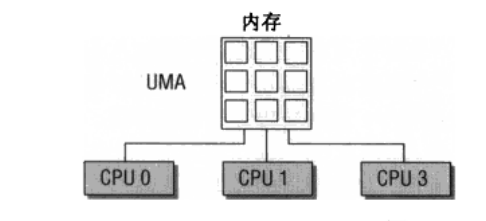
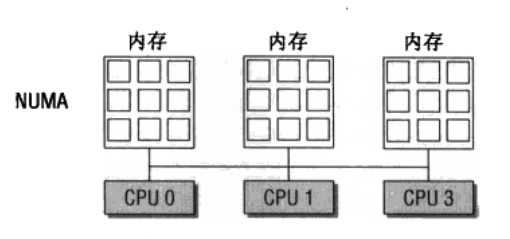
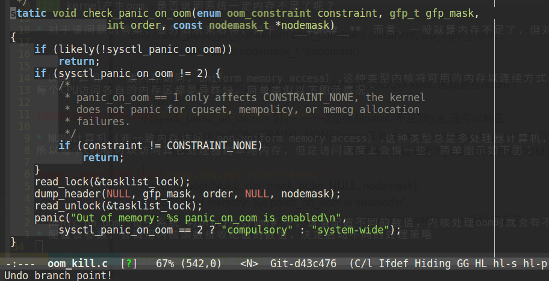
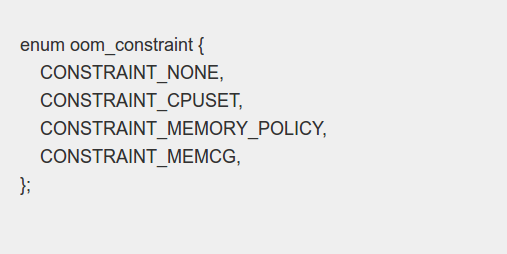
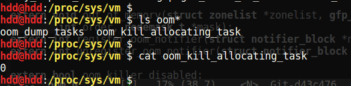
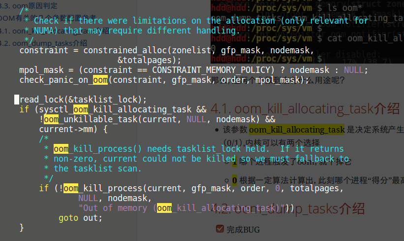
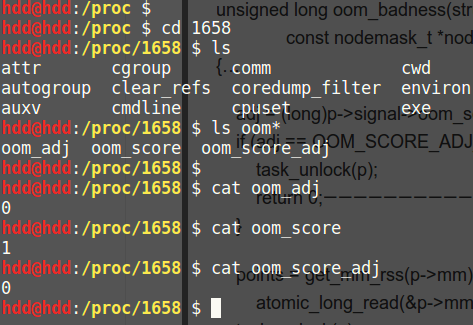

= linux内核内存管理之oom
认真
:toc:
:toclevels: 4
:toc-position: left
:source-highlighter: pygments
:icons: font
:sectnums:

== 什么是OOM
....
oom 是out of memory的缩写。对linux而言，内核一般将处理器的虚拟地址空间划分为两个部分。底部比较大的部分用于用户进程，
顶部专门用于内核。可用的物理内存被映射到内核的地址空间中，上层所有的进程不能直接操作物理内存，而是通过页表访问内存。
所以linux运行期间，需要不断的维护页表的申请，回收，再利用以保证程序可以有充足的可利用的内存。

那么，如果某个时刻，由于系统参数配置不当或者系统存在内存泄露等问题，造成了kernel分配page frame时候遇到内存耗尽，无法分配成功。
此时kernek遇到的情况，就是一种oom情形。
....

== OOM造成的后果

* linux kernel 遇到了oom会怎么样？通常内核此时有两种选择：

<1> 系统崩溃并产生堆栈，就是常说的kernel panic,也就是立刻死机

<2> 内核会启动一个机制：OOM Killer，仍然试图继续运行

    * OOM killer（Out-Of-Memory killer),该机制会监控系统中占用内存过大的进程，尤其是那些突然消耗非常大内存的进程，
　　
　　为了防止内存耗尽或者为了保证内核中重要进程有足够内存可以使用，会杀掉该进程，释放一部分内存出来。

== 产生oom的原因

TIP: kernel产生oom，是否说明系统一定内存不足了呢？

* 对于该问题的答案，要分情况来看待，对于 **__#UMA#__**  而言，一般就是内存不足了，但对于 **__#NUMA#__**  而言，并不一定。那么，究竟UMA和NUMA是什么？

=== UMA和NUMA介绍

* UMA计算机（一致内存访问，uniform memory access）,这种类型内核将可用的内存以连续方式组织起来（也可能存在小洞情况以后再总结），在SMP系统中
每个CPU访问各自的内存区都是异样快。简单类似以下图示情况：

* NUMA计算机（非一致内存访问，non-uniform memory access）,这种类型总是多处理器计算机，系统的每个CPU都有本地内存，各个CPU之间通过总线连接起来
所以每个CPU都可以访问其它处理器的本地内存，但是访问速度上会慢一些。简单图示如下图：

=== 参数panic_on_oom

* panic_on_oom　位于系统 #/proc/sys/vm/# 下，该值配置不同的数值，内核处理oom时就会有不同的策略
* 配置该参数，会调用内核函数接收配置的数值，决定启动不同的处理策略,内核接收函数如下图：

* 不同的参数值，表示内核遇到oom时，应当如何处置：
** panic_on_oom = 0 直接返回，相当于开启了oom_killer机制
** panic_on_oom = 1 并且没有配置无约束标志　**#CONSTRAINT_NONE#** ,可以尝试oom_killer。__但是UMA系统，该处总是 **#CONSTRAINT_NONE#**__
** panic_on_oom = 2 直接panic

=== oom原因判定

* 内核中有四个标志性变量，分别表示一定的约束条件，如下图所示：

* 每个标志位的含义解释如下，需要说明的是，下列配置选项仅针对 [red]#**__NUMA__**# :
** [red]#__CONSTRAINT_CPUSET__#  cpuset是linux kernel的一种机制，该机制可以把一组cpu和memory node分配给特定的
一组进程。如果此时出现了OOM，仅仅说明该进程能分配memory的那个node出现问题，此时系统还有很多内存。
** [red]#__CONSTRAINT_MEMORY_POLICY__#  memory policy是NUMA系统中，如何控制分配各个memory node资源的一个策略模块。
产生OOM，也可能是该memory policy出现问题导致。
** [red]#__CONSTRAINT_MEMCG__#  memory control group,简单说就是控制系统memory分配的控制器。该控制器可以将一组进程
内存使用限制在一个范围呢，如果超出该范围，就会出现 #OOM#
* 综上，对于UMA系统，出现OOM,一般就是内存不足了。但是对于NUMA系统，出现OOM,或许系统还有充足的内存，具体原因就要进一步分析了。

== OOM有关的几个参数配置参考

* 在系统路径　#/proc/sys/vm# 下，可以看到关于oom的有两个很关键的参数，如下图所示:

那么，这两个参数到底有什么用途呢？

=== oom_kill_allocating_task介绍

* 该参数 #oom_kill_allocating_task# 是决定系统产生oom后，oom_killer机制启动，内核到底可以杀掉哪个进程。
配置不同的数值（0/1）,内核可以有两个选择
** [red]**#1#** --哪个进程触发了oom，就干掉它
** [red]**#0#** --根据一定算法计算出，此刻哪个进程“得分”最高，干掉它
** 代码依据如下图所示:

=== oom_dump_tasks介绍

* 该参数 #oom_dump_task# 可以配置 #0# 或者 #1#,主要是系统产生oom时候，是否要收集输出一些进程信息。
** [red]**#0#** --不会打印出该信息
** [red]**#1#** --要去收集进程关于内存方面的信息并且打出，方便找出oom具体原因

=== 其他参数

* 常见的其他进程相关的oom参数有以下几个
** oom_adj
** oom_score
** oom_score_adj
* 这些参数位于 #/proc/PID/# 下，其中PID指的是进程ID,如下图

* 这些参数又有什么用呢？当系统出现oom时，又配置内核选择oom_killer机制时，内核会根据算法给每个进程一个
oom_score，分数越高，被内核杀掉的几率越高。然而这个oom_score是根据oom_obj计算出来的，oom_obj是可以配置的，
配置范围为15 ~ -16 之间，配置-17则说明，禁止使用oom_killer，参见以下内核代码：

image:image/oom_obj1.png[image,600,600,role="center"]

* 所以，如果要配置

[options=interactive]
- [*] 完成BUG
- [ ] 写总结
