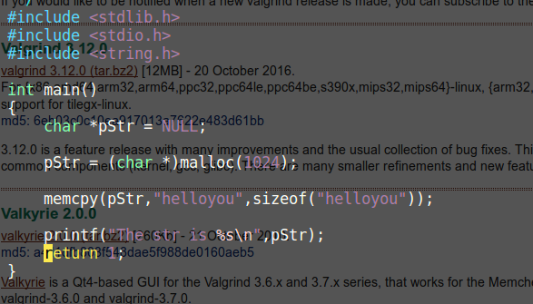
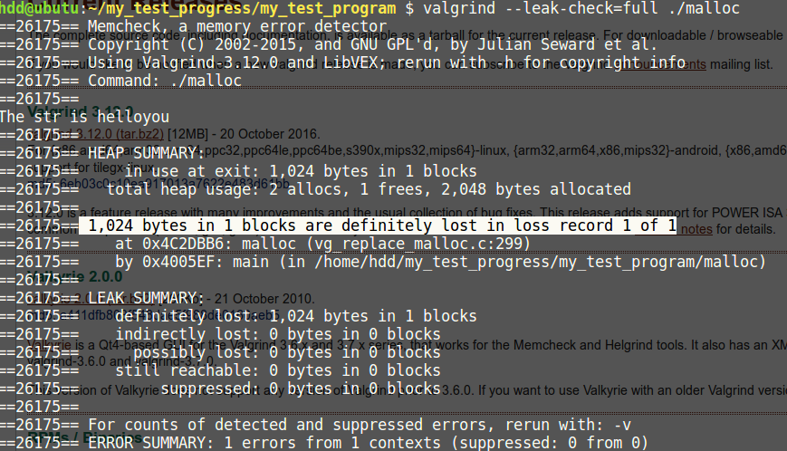

= 一种linux下检测内存泄露的方法
郝东东
:toc:
:toclevels: 4
:toc-position: left
:source-highlighter: pygments
:icons: font
:sectnums:

== 工具介绍

* linux下用户态程序，经常会遇到动态分配内存，调用malloc之类的分配函数

有时候程序嵌套比较深或者结构比较复制，往往忘记free申请的内存，这样就造成

了内存泄露，排查起来颇为吃力。

* 工具 #valgrind# 可以帮我们预先检查函数是否存在内存泄露的风险

=== valgring获取安装方法

* 获取工具
** valgrind官网地址: link:http://valgrind.org/[valgrind官网]
** 最新版本下载链接: link:http://valgrind.org/downloads/current.html#current[valgring最新版]
*** 下载后存放linux机器下，为valgrind-3.12.0.tar.bz2
*** tar jxf valgrind-3.12.0.tar.bz2 解压
*** 进入软件，./autogen.sh;./configure;make;make install
*** 以上步骤安装在本机上，参照软件中的　READEME

=== 简单使用

* 写一个内存泄露的代码，如下:

* gcc -o malloc malloc.c 编译代码，生成malloc程序

* 执行检查 #valgrind --leak-check=full ./malloc#
* 看到结果如下:

可以看到其中检查到一处内存泄露

== 更多valgrind用法

* 参考 link:http://valgrind.org/docs/manual/manual.html[valgrind用法]

