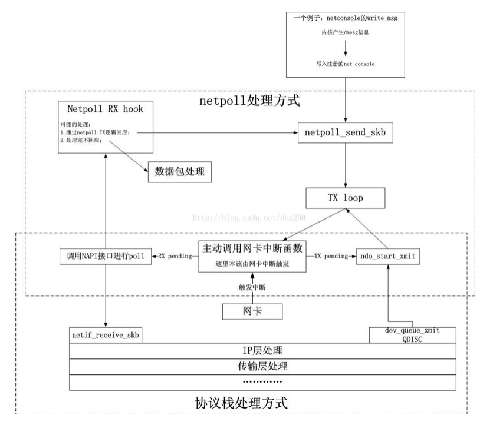

= linux下使用netconsole的方法总结
郝东东
:toc:
:toclevels: 4
:toc-position: left
:source-highlighter: pygments
:icons: font
:sectnums:

== netconsole介绍

* linux系统运行过程中，最大的隐患莫过于内核崩溃之后的异常堆栈死机.

通常这种堆栈引发的系统崩溃非常致命，又非常不太容易排查。尤其当设备在

外场工作时候，一旦发现异常都是系统重启之后，log以及堆栈信息通常并不一定

可以完整保留下来，这样就非常棘手。

* netconsole可以在系统产生堆栈信息，网络系统彻底瘫痪之前的时间里,通过内核

的netpoll机制直接将内核的堆栈信息通过驱动网卡直接发送至远端的服务器。

=== netpoll简单原理介绍

* 简单来说就是不依靠内核传统报文协议栈，不依靠中断去发包。

** 主动调用网卡的中断处理函数，获取当前该发送数据包还是接收到一个数据包；
** 直接hard_xmit数据包或者使用NAPI的接口去poll网卡的数据。
* 基本原理图如下图所示:

==  具体使用

* 检查当前系统中是否已经加载了netconsole模块，如果没有

就重新makemecuconfig内核，重新打开netconsole有关选项，

重新编译内核版本。

NOTE: 注意，重新编译后的内核要和netconsole模块一起加载系统使用
否则，会发现加载netconsole时候出现netpoll符号表不识别的情况。

* 加载netconsole后的系统，就可以直接配置了，配置参数如下:

** modprobe netconsole netconsole=6666@192.168.1.1/eth4,514:192.168.1.2/00:34:cb:11:22:33

** 以上参数解释如下:
***  #6666# -- 本地端口
***  192.168.1.1-- 本地通信IP地址
***  514:远程主机的syslog侦听端口,也可以是其他端口只要有服务侦听
***  192.168.1.2 远端服务器的IP地址
***  #__00:34__# --远程主机的MAC地址

* 514端口是syslog的侦听端口，需要在远程主机上配置syslog接受
** vi /etc/sysconfig/syslog中配置SYSLOGD_POTIONS="-r -m "

* 测试主机可以出发一个堆栈，在远程主机上就可以捕捉到堆栈信息

* 参考 link:http://blog.csdn.net/dog250/article/details/45788497[netpoll和netconsole]

