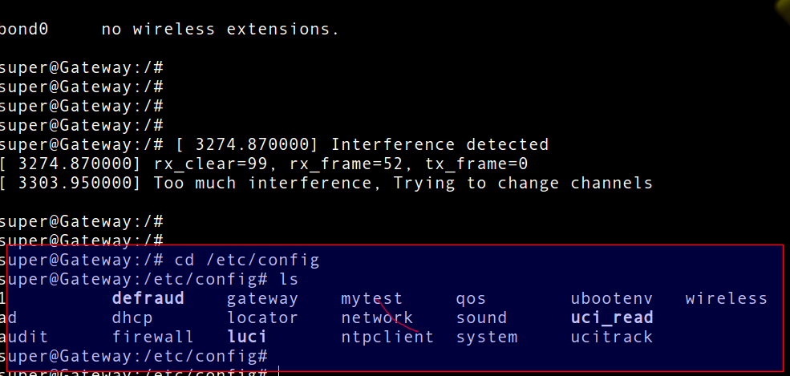
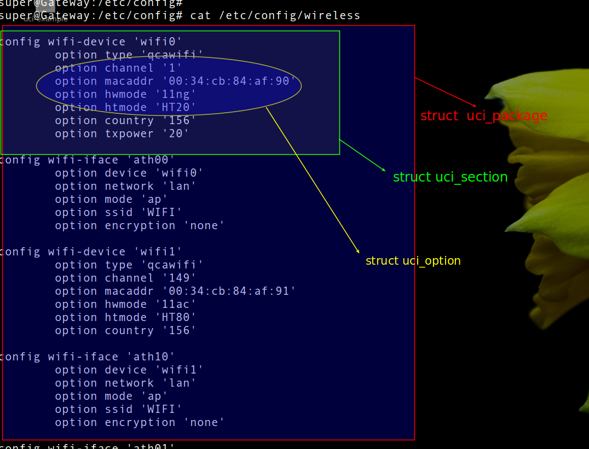

= uci学习
认真
:toc:
:toclevels: 4
:toc-position: left
:source-highlighter: pygments
:icons: font
:sectnums:

== uci定义
[options=interactive]

TIP: uci是openWRT系统引入的一个软件包,是为了实现配置集中化管理.通过uci提供的API函数，可以方便
地通过调用实现配置增删改查等操作。UCI也提供了命令行，可以在命令行直接调用。

== uci配置结构解析

* uci的一个配置文件结构包含以下几个关键要素:
** 包(package)
** 节点(section)
** 数值(value)

* 系统所有的配置文件都储存在 __/etc/config__ 中，参见下图:

**  
**  

== uci命令行使用

* uci提供了方便的命令行可以供我们调用，命令行参数如下:

** image:image/pic_uci3.png[image,600,600,role="center"]

** 常用的功能
*** 查看所有配置: __uci show__ ,看到效果如下

** image:image/pic_uci4.png[image,600,600,role="center"]

* 查看具体的配置，需要具体参数，比如查看无线配置相关

** uci show wireless --查看无线所有配置，如下图

** image:image/pic_uci5.png[image,600,600,role="center"]

* 增加一个ssid示例:

