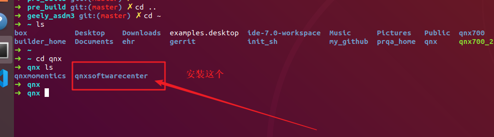
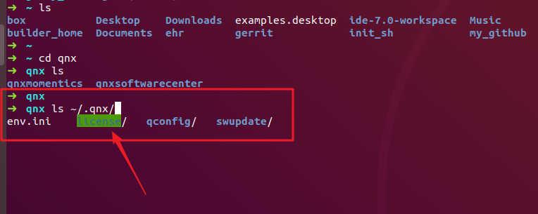
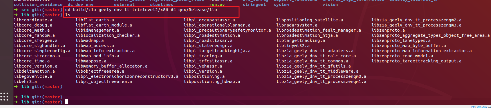
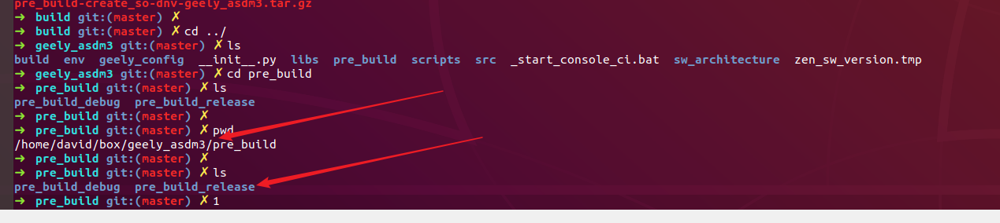

= How to building zenuity's code
David Hao
:toc:
:toclevels: 4
:toc-position: left
:source-highlighter: pygments
:icons: font
:sectnums:

== 编译环境准备（linux环境）

TIP: 1.Zenuity's 的代码工程    2.qnx的linux安装版本

=== Zenuity的工程下载

IMPORTANT: 所有编译都在linux环境下,而且保证geely_asdm3,src,geely_denv_build_env在同一个目录层级

* 源代码
**  git clone "ssh://#david.hao#@gerrit.zen.gci.corp.int:29418/geely_denv_build_env"
**  git clone "ssh://#david.hao#@gerrit.zen.gci.corp.int:29418/geely_asdm3"
**  git clone "ssh://#david.hao#@gerrit.zen.gci.corp.int:29418/src" && scp -p -P 29418 #david.hao#@gerrit.zen.gci.corp.int:hooks/commit-msg "src/.git/hooks/"
* 更新
** cd geely_asdm3 && git submodule update --init --recursive && cd -

=== qnx软件安装

IMPORTANT: 下载qnx-softwarecenterv1.3版本，并在linux下安装，安装完成之后安装qnx700

* 所有软件已经下载好，请访问这里获取:

* 安装Software-center
* 在SoftWareCenter中安装qnx700
* copy ~/qnx700 /root 下

* 安装结束，请确认在 #*~/.qnx*# 下有qnx的License存在 <这步非常关键>

== 修改配置脚本

===  修改create_so-dnv.sh

* #**vi geely_asdm3/geely_config/pre_build/create_so-dnv.sh**#
* 注释掉 #python3 $SCRIPT_DIR/dnv_fetch.py -b $BUILD_CONFIG_FILE -p $PROJECT_CONFIG_FILE -r $ROOT_DIR#

=== 修改 py_env_build_scripts.sh

* #**vi geely_asdm3\env\sw_integration_common\scripts\pyenv\py_env_build_scripts.sh**#
* 在28行后面添加
----
python3 -m pip install -i https://artifactory.zen.gci.corp.int/api/pypi/zenuity-pypi/simple --trusted-host artifactory.zen.gci.corp.int --no-binary veoneer-certifi veoneer-certifi
----
* 将该脚本中所有的 #python# 替换为 #python3#

=== 修改 requirement.txt

* #**vi  geely_asdm3\env\sw_integration_common\scripts\pyenv\requirement.txt**#
* 删除 #zenuity_ci>=1.980#

== 安装python工具

* #**sudo apt-get install python3-venv**#

== 开始编译

* cd /src
* #python3 ./run.py fetch_generated_code#
* #python3 ./pipelines/z1a_geely/src_config/build/z1a_geely_dnv_tt-trimlevel2.py#
** 该步骤执行过程一般会有错误，那是因为工程不干净，所以先执行 git reset--hard  && git clean -fdx && git pul
** 该步骤成功后，会编译生成所有的库,全部都是.a库，在路径：#src/build/z1a_geely_dnv_tt-trimlevel2/x86_64_qnx/Release/lib#

NOTE: 这是最关键的一步，因为所有的源码都在这一步真正编译生成库文件，执行时间大概半小时左右

* 拷贝所有的编译出来的静态库到指定目录: __#cp -rf src/build/z1a_geely_dnv_tt-trimlevel2/x86_64_qnx/Release/lib/*.a /geely_asdm3/libs#__

* 执行脚本: #/geely_config/pre_build/create_so-dnv.sh#

* 静静等待即可，编译完成后，会生成在 #geely_asdm3/pre_build# 下看到编译的so文件

NOTE: 以上仅仅是粗略的步骤，执行过程中难免会有什么问题，具体问题再具体解决吧，但是总可以解决。

....
以上是自己的一点总结
....
