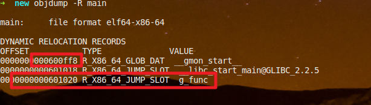

= Qnx 动态链接原理
郝东东
:toc:
:toclevels: 4
:toc-position: left
:source-highlighter: pygments
:icons: font
:sectnums:

== 静态链接重定位

* 什么是链接重定位？
** 链接时候进行符号表地址重定位，因为编译器无法去全局照顾每一个符号，尤其是模块间的函数调用
** 举例：函数调用

image:../image/PLT0.png[image,1100,1100,role="center"]

*** 对编译期间的 main.o进行反汇编(objdump),查看汇编代码可以发现：main里针对函数my_test的符号解析
填充的其实是一个错误值，是不对的。如下

image:../image/plt4.png[image,1000,1000,role="center"]

*** 链接完成之后呢？再次针对main进行反汇编(objdump)，就会发现，链接时候已经做了填充，如下:

image:../image/plt5.png[image,1000,1000,role="center"]

** 思考：静态链接的关键在于，编译器先预先“占位”，链接阶段由链接器根据相对地址引用计算出绝对地址修正"占位"
   时候的空白值或者错误值。

   那么，动态链接是否也可以这么做呢？

== 引出动态连接技术

* 举个例子先
** main.c 需要链接lib1.so执行。首先编译(.o),链接(ELF),反汇编(objdump),ELF查看(readelf)

*** main.c如下

*** 1.c如下

image:../image/plt8.png[image,1000,1000,role="center"]

*** 编译
**** 将1.c编译成动态库，将main编译成ELF并链接该动态库 #*lib1.so*#
***** #gcc -shared -fPIC 1.c -o lib1.so -g#

***** #*gcc main.c -L. -l1 -o main -g*#

*** 用objdump -S main.o > main.asm, 查看 main.asm可以看到main里调用
#g_func# 的汇编处，如下图

----
这里最值得注意的是汇编的：call 400570<g_func@plt>
我们知道g_func这个函数是在lib1.so中定义的，但是这个时候，动态库lib1.so还并未加载，所以lib1.so
加载时候会被加载在内存的哪个地址都是未知的，但是链接器又必须生成call function的指令，这就是问题
那么，call后面的这个地址:  #*0x400570*# 到底是指向了哪里呢？
----

*** 我们继续看main.asm汇编可以发现，这个call 0x******** 在链接器阶段，指向了一个叫做 .plt表的
一个地址，该地址中存放了一份g_func()的影子函数，详细如下图

*** 其实到这里我们知道，动态链接的过程肯定和.plt有关，但是这个plt究竟充当多大作用，是如何辅助动态链接的
这里还看不出。

*** 执行 #*objdump -R main*# 可以看到一些信息输出，其中就有 #g_func# ,注意前面的地址: #0x600ff8#,
   再结合man的汇编，可以发现在 g_func@plt中，有一个 jump指令： #jmpq   *0x200aaa(%rip) # 601020 <_GLOBAL_OFFSET_TABLE_+0x20>#
   .可以发现这个地址 0x601020 后面有一个GLOBAL_OFFSET_TABLE，这个就是大名鼎鼎的 #GOT# 表。
   见下图

*** 把整个过程总结如下：

**** 其实不难看出，链接结束后，虽然链接器并不知道调用的g_func地址在哪里，但是汇编里写入的是指向PLT(Procedure Link Table)表中
一个地址的指令，通过简单分析我们知道，PLT表中的这个地址，其实是指向了 GOT(Global Offset Table)表中的一个地址。这个可以简单总结
如下

***** main-->call g_func-->g_func@plt-->g_func@got

*** 最后，再用 #readelf -l main#  查看下 .plt和.got分别属于编译后哪个section里，如下图：

TIP: 问题：Lib1.so加载完成之后如何去重新修正函数 g_func的真正地址呢？

* 有两个方案：
1. 运行时候直接修改 .text段call g_func，修改成真正地址。显然不可行，Why?
2. 把g_func函数地址固定一个不变的地址，每次加载不用这么麻烦。可行，但是这样
一来，动态库的共享优势荡然无存。
所以，需要一个机制，去解决这个问题，如何解决？
PIC技术和LB(Lazy building),当然离不开 PLT和GOT

== 动态链接技术剖析

* 动态加载流程

** 动态加载基本流程

image:../image/plt6.png[image,1000,1000,role="center"]

** ELF Header内容(readelf -h main/readelf -l main)

image:../image/plt10.png[image,1000,1000,role="center"]

* 动态链接技术的出现，解决了静态库耦合依赖，以及浪费内存问题。使得多个进程共享一个动态库成为可能。
在一定程度上节省了内存。延迟绑定(Lazy building)以及地址无关技术(PIC position-Independent-Code )的运用，让这个优势更加明显。

== 技术简介

* 动态链接技术说白了就是解决了一个运行时候重定位问题。把程序原本链接时候符号重定位变成了运行时候动态重定位。
  是如何做的呢？
* 其实就是延迟绑定。存放函数地址的数据表，称为全局偏移表 GOT（#__GOT, Global Offset Table__#），而那个额外代码段表，
  称为程序链接表 PLT（#__PLT，Procedure Link Table__#）。

* 一切的一切，都是这两个表的杰作: *#PLT#* 和 *#GOT#*

* 先用官方枯燥无味的话大概总结下这个过程

....

当需要动态链接时，内核会引导动态链接（ELF 解释器），该链接首先会初始化自身，然后加载指定的共享对象（已加载则不必）。接着它会执行必要的再定位，包括目标共享对象所使用的共享对象。LD_LIBRARY_PATH 环境变量定义查找可用共享对象的位置。定义完成后，控制权会被传回到初始程序以开始执行。
重定位是通过一个称为 GOT和PLT的间接机制来处理的。这些表格提供了 ld-linux.so 在重定位过程中加载的外部函数和数据的地址。这意味着无需改动需要间接机制（即，使用这些表格）的代码：只需要调整这些表格。一旦进行加载，或者只要需要给定的函数，就可以发生再定位（稍候在 用 Linux 进行动态加载 小节中会看到更多的差别）。
再定位完成后，动态链接器就会允许任何加载的共享程序来执行可选的初始化代码。该函数允许库来初始化内部数据并备之待用。这个代码是在上述 ELF 映像的 .init 部分中
定义的。在卸载库时，它还可以调用一个终止函数（定义为映像的 .fini 部分）。当初始化函数被调用时，动态链接器会把控制权转让给加载的原始映像。
....

== PLT和GOT详解

=== 重定位

* 符号重定位，本质上是要解决当前编译单元如何访问“外部”符号这个问题。

** ELF头部信息:

** 对于可执行文件来说，符号重定位是在链接阶段完成的。但是动态库是在运行时候才加载进来
  所以，对于动态库里符号的重定位，只能推迟。称作动态加载(Dynamic Loading,DL)

** #redaelf# 命令，可以查看ELF(Executable and Linking Format，ELF)文件
*** #readelf -r# 查看重定位段情况
*** #readelf -d# 可以看到程序所需动态库

** 链接时符号重定位举例
*** 代码1.c 和 main.c

image:../image/plt2.png[image,800,800,role="center"]

----
action direction [log] [quick] on interface [af] [proto protocol] \
from src_addr [port src_port] to dst_addr [port dst_port] \
[tcp_flags] [state]
----

....
以上是自己的一点总结
....
