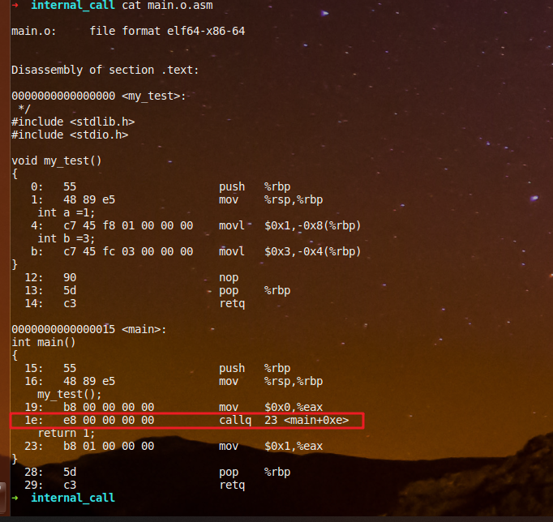
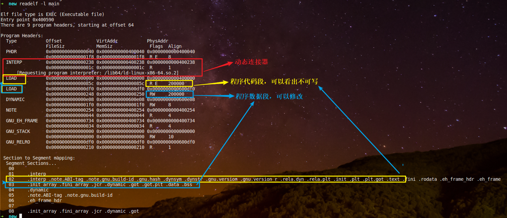

= Qnx 动态链接原理
郝东东
:toc:
:toclevels: 4
:toc-position: left
:source-highlighter: pygments
:icons: font
:sectnums:

== 静态链接重定位

* 什么是链接重定位？
** 链接时候进行符号表地址重定位，因为编译器无法去全局照顾每一个符号，尤其是模块间的函数调用
** 举例：函数调用

*** 对编译期间的 main.o进行反汇编(objdump),查看汇编代码可以发现：main里针对函数my_test的符号解析
填充的其实是一个错误值，是不对的。如下

*** 链接完成之后呢？再次针对main进行反汇编(objdump)，就会发现，链接时候已经做了填充，如下:

== 动态连接技术

* 举个例子先
** main.c 需要链接lib1.so执行。首先编译(.o),链接(ELF),反汇编(objdump),ELF查看(readelf)

*** main.c如下

image:../image/plt7.png[image,800,800,role="center"]

*** 1.c如下

* 动态加载流程

** 动态加载基本流程

** ELF Header内容(readelf -h main/readelf -l main)

image:../image/plt9.png[image,800,800,role="center"]

* 动态链接技术的出现，解决了静态库耦合依赖，以及浪费内存问题。使得多个进程共享一个动态库成为可能。
在一定程度上节省了内存。延迟绑定以及地址无关技术的运用，让这个优势更加明显。

== 技术简介

* 动态链接技术说白了就是解决了一个重定位问题。把程序原本链接时候符号重定位变成了运行时候动态重定位。
  是如何做的呢？
* 其实就是延迟绑定。存放函数地址的数据表，称为重局偏移表（GOT, Global Offset Table），而那个额外代码段表，
  称为程序链接表（延迟绑定技术）（PLT，Procedure Link Table）。它们两姐妹各司其职，联合出手上演这一出运行时重定位好戏。

* 当需要动态链接时，内核会引导动态链接（ELF 解释器），该链接首先会初始化自身，然后加载指定的共享对象（已加载则不必）。接着它会执行必要的再定位，包括目标共享对象所使用的共享对象。LD_LIBRARY_PATH 环境变量定义查找可用共享对象的位置。定义完成后，控制权会被传回到初始程序以开始执行。
再定位是通过一个称为 Global Offset Table（GOT）和 Procedure Linkage Table（PLT）的间接机制来处理的。这些表格提供了 ld-linux.so 在再定位过程中加载的外部函数和数据的地址。这意味着无需改动需要间接机制（即，使用这些表格）的代码：只需要调整这些表格。一旦进行加载，或者只要需要给定的函数，就可以发生再定位（稍候在 用 Linux 进行动态加载 小节中会看到更多的差别）。
再定位完成后，动态链接器就会允许任何加载的共享程序来执行可选的初始化代码。该函数允许库来初始化内部数据并备之待用。这个代码是在上述 ELF 映像的 .init 部分中定义的。在卸载库时，它还可以调用一个终止函数（定义为映像的 .fini 部分）。当初始化函数被调用时，动态链接器会把控制权转让给加载的原始映像。
== PLT和GOT详解
=== 重定位

* 符号重定位，本质上是要解决当前编译单元如何访问“外部”符号这个问题。
** ELF头部信息:
image:../image/plt3.png[image,800,800,role="center"]
** 对于可执行文件来说，符号重定位是在链接阶段完成的。但是动态库是在运行时候才加载进来
  所以，对于动态库里符号的重定位，只能推迟。称作动态加载(Dynamic Loading,DL)

** #redaelf# 命令，可以查看ELF(Executable and Linking Format，ELF)文件
*** #readelf -r# 查看重定位段情况
*** #readelf -d# 可以看到程序所需动态库

** 链接时符号重定位举例
*** 代码1.c 和 main.c
image:../image/plt1.png[image,800,800,role="center"]

* 加载配置： #pfctl -f /etc/pf.conf#

== pf.conf 语法以及配置规则

* pf.conf有七个参数

----
action direction [log] [quick] on interface [af] [proto protocol] \
from src_addr [port src_port] to dst_addr [port dst_port] \
[tcp_flags] [state]
----

* 展开
** action
*** pass
*** block:drop/return
** direction
*** in
*** out

* 具体每个参数含义
**  #*action*#
*** 数据包匹配规则时执行的动作，pass或者block。pass动作把数据包传递给核心进行进一步出来，block动作根据block-policy 选项指定的方法进行处理。默认的动作可以修改为阻塞丢弃或者阻塞返回。
**  #*direction*#
***  数据包传递的方向，进或者出
**  #*log*#
*** 指定数据包被pflogd( 进行日志记录。如果规则指定了keep state, modulate state, or synproxy state 选项，则只有建立了连接的状态被日志。要记录所有的日志，使用log-all
**  #*quick*#
*** 如果数据包匹配的规则指定了quick关键字，则这条规则被认为时最终的匹配规则，指定的动作会立即执行。
**  #*interface*#
*** 数据包通过的网络接口的名称或组。组是接口的名称但没有最后的整数。比如ppp或fxp，会使得规则分别匹配任何ppp或者fxp接口上的任意数据包。
**  #*af*#
*** 数据包的地址类型，inet代表Ipv4，inet6代表Ipv6。通常PF能够根据源或者目标地址自动确定这个参数。
**  #*protocol*#
*** 数据包的4层协议:
**** tcp
**** udp
**** icmp
**** icmp6
/etc/protocols中的协议名称
0～255之间的协议号
使用列表的一系列协议.
**  #*src_addr, dst_addr*#
*** IP头中的源/目标地址。地址可以指定为：
单个的Ipv4或者Ipv6地址.
o :network - 替代CIDR网络地址段 (例如：192.168.0.0/24)
o :broadcast - 替代网络广播地址(例如：192.168.0.255)
o :peer - 替代点到点链路上的ip地址。

** #*any*# 代表所有地址
关键字 all 是 from any to any的缩写。
**  #*src_port, dst_port*#
4层数据包头中的源/目标端口。端口可以指定为：
1 到 65535之间的整数
/etc/services中的合法服务名称
** 使用列表的一系列端口
一个范围:
o != (不等于)
o  (大于)
o = (大于等于)
o > (反转范围)
**  #*tcp_flags*#
*** 指定使用TCP协议时TCP头中必须设定的标记。 标记指定的格式是： flags check/mask. 例如: flags S/SA -这指引PF只检查S和A(SYN and ACK)标记，如果SYN标记是“on”则匹配。
**  #*state*#
*** 指定状态信息在规则匹配时是否保持。
*** keep state - 对 TCP, UDP, ICMP起作用
**** modulate state - 只对 TCP起作用. PF会为匹配规则的数据包产生强壮的初始化序列号。
**** synproxy state - 代理外来的TCP连接以保护服务器不受TCP SYN FLOODs欺骗。这个选项包含了keep state 和 modulate state 的功能。

=== 应用举例

* 以QNX虚拟机应用为例子说明用法（以ipv4为例）

** 进入虚拟机qnx系统
** 从qnx700中拷贝所需的库 lsm-pf-v4.so到 /lib/dll/下
** 从qnx700中拷贝 pfctl 到/usr/sbin下
** 两种方法启动lsm-pf-v4.so
*** 用命令 #mount -Tio-pkt lsm-pf-v4.so# 即可
*** 修改/etc/startup.sh 将其中的 #*io-pkt-v4-hc -dvmxnet3*# 后面追加参数 #*-p pf-v4*#,然后重启虚拟机即可

** 配置 pf.conf配置规则,打开虚拟机 #/etc/pf.conf# 文件，写入如下配置后保存

....
set block-policy drop //将block动作设置为丢弃
block drop all  //默认丢弃所有数据
pass in proto {icmp udp tcp} from 192.168.40.1 to 192.168.40.128 //针对进口in配置白名单，IP和协议都可以修改
pass out proto {icmp udp tcp} from 192.168.40.128 to 192.168.40.1 //针对出口out配置白名单，IP和协议都可以修改
....

** 验证上面的配置

** 规则生效之前，虚拟机可以访问公网

image:../image/pf_2.png[image,800,800,role="center"]

** 可以看出主机是可以ping通 qq服务器的

** 启动服务
*** pfctl -e
*** pfctl -Rf /etc/pf.conf
** 规则生效之后

image:../image/pf_3.png[image,800,800,role="center"]

** 查看命中情况

image:../image/pf_4.png[image,800,800,role="center"]

....
以上是自己的一点总结
....
