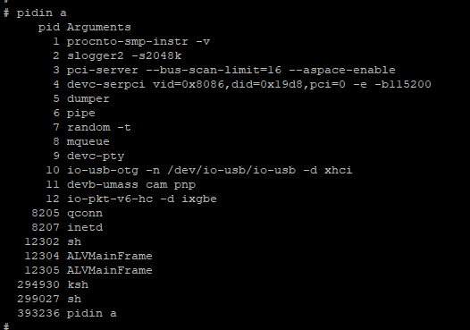
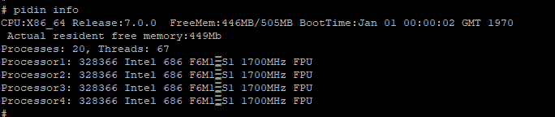
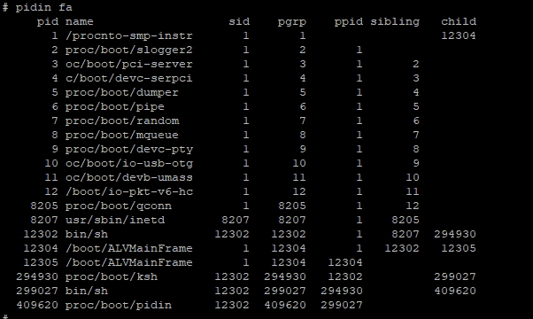
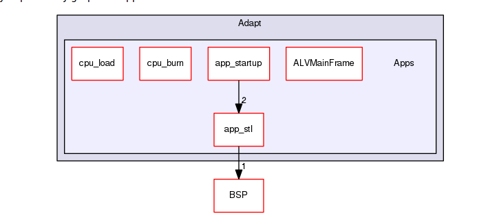
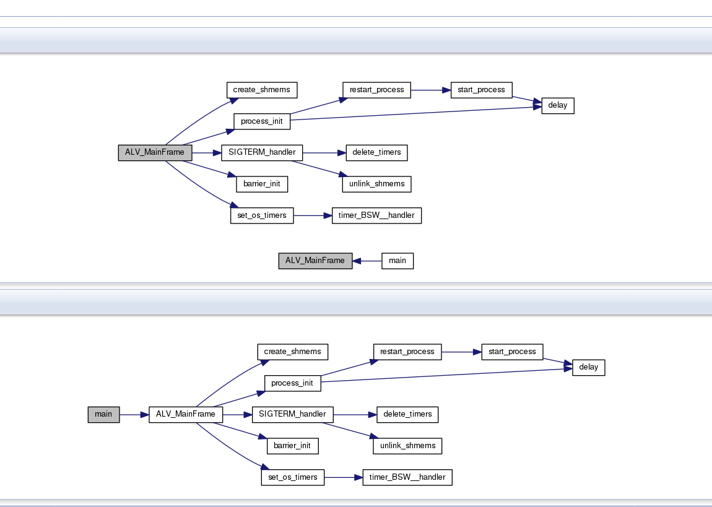
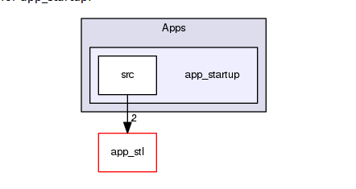
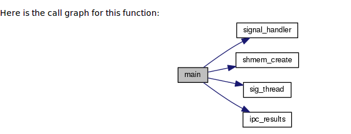

= PerformanceMCU学习

郝东东
:toc:
:toclevels: 4
:toc-position: left
:source-highlighter: pygments
:icons: font
:sectnums:

== 组织架构

*  \PerformanceMCU\Source\Adapt\BSP\prebuilt\x86_64\usr\bin 下统一存放编译好的二进制
*  C:\PerformanceMCU\Source\Adapt\BSP\

== 命令

* pidin 查看内存
** pidin mem 查看内存信息
** pidin a 显示当前进程名字

  

** pidin info 可以显示内存等信息

  

** pidin fa 可以显示进程以及子进程信息

  

== 软件结构架构

* APPs下结构

  

=== ALVMainFrame

* 代码架构图如下
  

=== app_startup

* 整体结构图
  

* 代码框架图

  

....
以上是自己的一点总结
....
