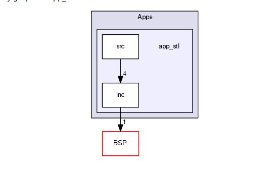
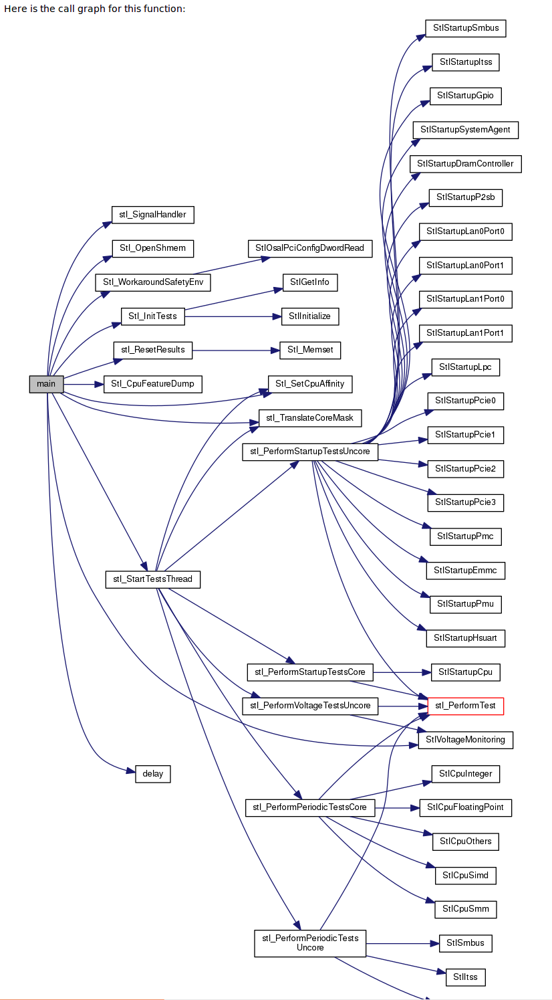
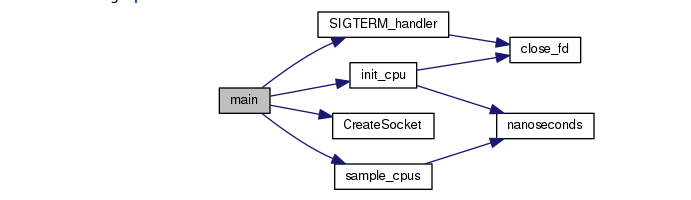
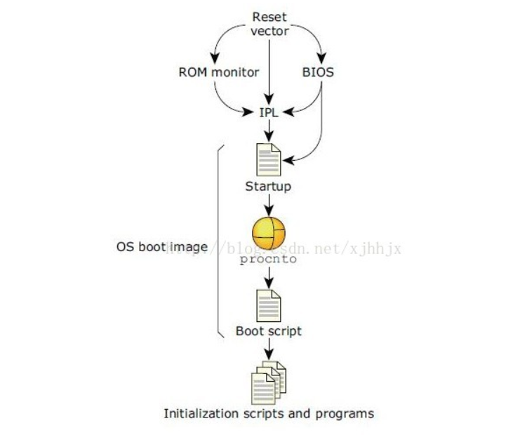

= PerformanceMCU学习
郝东东
:toc:
:toclevels: 4
:toc-position: left
:source-highlighter: pygments
:icons: font
:sectnums:

== 组织架构

*  \PerformanceMCU\Source\Adapt\BSP\prebuilt\x86_64\usr\bin 下统一存放编译好的二进制

*  C:\PerformanceMCU\Source\Adapt\BSP\

== 命令

* pidin 查看内存

** pidin mem 查看内存信息

** pidin a 显示当前进程名字

image:../image/qnx_0.png[image,800,800,role="center"]

** pidin info 可以显示内存等信息

image:../image/qnx_1.png[image,800,800,role="center"]

** pidin fa 可以显示进程以及子进程信息

image:../image/qnx_2.png[image,800,800,role="center"]

== 软件结构架构

* APPs下结构

image:../image/qnx_3.png[image,800,800,role="center"]

=== ALVMainFrame

* 代码架构图如下

image:../image/qnx_4.png[image,800,800,role="center"]

=== app_startup

* 整体结构图

image:../image/qnx_6.png[image,800,800,role="center"]

* 代码框架图

image:../image/qnx_5.png[image,800,800,role="center"]

=== app_stl

* 整体结构图

* 代码结构图

=== cpu_load

* 代码框架图

== qnx启动流程

* 系统启动时会将 CPU 重置 (Reset) ，被重置后 CPU 会执行重置 Vector 中的代码。在 X86 平台中通常都是 BIOS ，在其他平台上可以使 ROM 或直接跳至 IPL 。 BIOS 或 ROM执行后通常跳至 IPL(Initial Program Load) 。 IPL 将启动镜像复制到内存中，并跳至启动 (Startup) 。启动代码会初始化硬件，并为内核的启动收集硬件信息。然后加载并启动procnto( 内核和进程管理器 ) 。
IPL 和 startup 通常都是 BSP(Board Support Package) 的一部分。 Procnto 启动后会执行启动脚本 (boot script) ，启动脚本控制具体的执行环境和第三方程序的启动。

== denverton intel configured

* 步骤如下

<1> 取到 ddr4的配置文件：.csv,放在ABL_CL1846\IFWIs_ALV\configuration\cdata 下
<2> ABL_CL1846\IFWIs_ALV\tools\FlashImageTool\spsFIT.exe  打开配置ini文件：ABL_CL1846\IFWIs_ALV\configuration\DNV_B0_AD_ALV_B02.xml
  然后配置 #trap 7  ，将 CCM2-->CCFP,再将 memory load 改成 0XA
<3> 配置qnx_kernel,需要将x86_64-denvertion.bin 转换为 x86_64-denvertion.ias,转换方法：/IFWI/tools/iasimage/iasimage.py
 ./iasimage.py create -o x86_64-denverton.ias -i 0x40000 x86_64-denverton.bin
<4> 将转换好的os.ias 拷贝到合适的目录下，然后修改PerformanceMCU\Tools\Intel\ABL_CL1846\IFWIs_ALV\ALV_B02_ABL_FSP_LAN0-LEK4-B0_LAN1-LEK4-B0_ELK.ini文件
主要修改 os=os = ingredients\x86_64-denverton.ias@0x00   os_size=实际大小
<5> 调用ifwi_gen_tool.py  --conig  ALV_B02_ABL_FSP_LAN0-LEK4-B0_LAN1-LEK4-B0_ELK.ini生成最终的版本，烧入即可

....
以上是自己的一点总结
....
