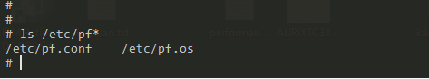

= Qnx Firewall学习
郝东东
:toc:
:toclevels: 4
:toc-position: left
:source-highlighter: pygments
:icons: font
:sectnums:

== Firewall介绍

*  对于系统而言，暴露在公网中和所有节点进行以太网通信其实具有一定的风险。因为对于任何一台设备
而言只要可以收发报文，就可以进行攻击以及欺骗。防火墙其实是协议栈实现的一种过滤策略，配置策略
行为，从而对网口的所有流量进行过滤控制进而转发。

== qnx防火墙

* 官网针对其的描述: link:http://www.qnx.com/developers/docs/7.0.0/index.html#com.qnx.doc.neutrino.utilities/topic/l/lsm-pf.so.html[防火墙库]

== 开启和使用qnx防火墙

* 首先进入qnx系统，加载支持防火墙业务所需库: lsm-pf-v4.so/lsm-pf-v6.so
** 如何加载: io-pkt-v4-hc -p pf-v4 或者  mount -Tio-pkt lsm-pf-v4.so 都可以
** 如何确认成功：成功加载后，会默认在系统 #/etc/# 下生成 *pf.conf* 和 *pf.os*

* 启动服务： pfctl -e

* 查看： pfctl -sr/-sa/-ss/-si

** pfctl -sn 显示当前的NAT规则
** pfctl -sr 显示当前的过滤规则
** pfctl -ss 显示当前的状态表
** pfctl -si 显示过滤状态和计数
** pfctl -sa 显示任何可显示的

* 加载配置： #pfctl -f /etc/pf.conf#
** pfctl -f /etc/pf.conf 载入 pf.conf 文件
** pfctl -nf /etc/pf.conf 解析文件，但不载入
** pfctl -Nf /etc/pf.conf 只载入文件中的NAT规则
** pfctl -Rf /etc/pf.conf 只载入文件中的过滤规则

== pf.conf 语法以及配置规则

* pf.conf有七个参数

image:../image/pf_1.png[image,800,800,role="center"]

** 宏:              用户定义的变量，包括IP地址，接口名称等等
** 表:              一种用来保存IP地址列表的结构
** 选项:          控制PF如何工作的变量
** 整形:          重新处理数据包，进行正常化和碎片整理
** 排队:          提供带宽控制和数据包优先级控制.
** 转换:          控制网络地址转换和数据包重定向.
** 过滤规则:   在数据包通过接口时允许进行选择性的过滤和阻止

* 基本规则语法

----
action direction [log] [quick] on interface [af] [proto protocol] \
from src_addr [port src_port] to dst_addr [port dst_port] \
[tcp_flags] [state]
----

* 展开
** action
*** pass
*** block:drop/return
** direction
*** in
*** out
* 具体

** action
*** 数据包匹配规则时执行的动作，放行或者阻塞。放行动作把数据包传递给核心进行进一步出来，阻塞动作根据block-policy 选项指定的方法进行处理。默认的动作可以修改为阻塞丢弃或者阻塞返回。
** direction
*** 数据包传递的方向，进或者出
** log
*** 指定数据包被pflogd( 进行日志记录。如果规则指定了keep state, modulate state, or synproxy state 选项，则只有建立了连接的状态被日志。要记录所有的日志，使用log-all
** quick
*** 如果数据包匹配的规则指定了quick关键字，则这条规则被认为时最终的匹配规则，指定的动作会立即执行。
** interface
*** 数据包通过的网络接口的名称或组。组是接口的名称但没有最后的整数。比如ppp或fxp，会使得规则分别匹配任何ppp或者fxp接口上的任意数据包。
** af
*** 数据包的地址类型，inet代表Ipv4，inet6代表Ipv6。通常PF能够根据源或者目标地址自动确定这个参数。
** protocol
*** 数据包的4层协议:
**** tcp
**** udp
**** icmp
**** icmp6
/etc/protocols中的协议名称
0～255之间的协议号
使用列表的一系列协议.
** src_addr, dst_addr
*** IP头中的源/目标地址。地址可以指定为：
单个的Ipv4或者Ipv6地址.
o :network - 替代CIDR网络地址段 (例如：192.168.0.0/24)
o :broadcast - 替代网络广播地址(例如：192.168.0.255)
o :peer - 替代点到点链路上的ip地址。

** any 代表所有地址
关键字 all 是 from any to any的缩写。
** src_port, dst_port
4层数据包头中的源/目标端口。端口可以指定为：
1 到 65535之间的整数
/etc/services中的合法服务名称
** 使用列表的一系列端口
一个范围:
o != (不等于)
o  (大于)
o = (大于等于)
o > (反转范围)
** tcp_flags
*** 指定使用TCP协议时TCP头中必须设定的标记。 标记指定的格式是： flags check/mask. 例如: flags S/SA -这指引PF只检查S和A(SYN and ACK)标记，如果SYN标记是“on”则匹配。
** state
*** 指定状态信息在规则匹配时是否保持。
*** keep state - 对 TCP, UDP, ICMP起作用
**** modulate state - 只对 TCP起作用. PF会为匹配规则的数据包产生强壮的初始化序列号。
**** synproxy state - 代理外来的TCP连接以保护服务器不受TCP SYN FLOODs欺骗。这个选项包含了keep state 和 modulate state 的功能。

=== 应用举例

* pf.conf配置规则

....
set block-policy drop
block drop all
pass in proto {icmp udp tcp} from 192.168.40.1 to 192.168.40.128
pass out proto {icmp udp tcp} from 192.168.40.128 to 192.168.40.1
....

* 验证上面的配置

** 规则生效之前

image:../image/pf_2.png[image,800,800,role="center"]

** 可以看出主机是可以ping通 qq服务器的

** 规则生效之后

image:../image/pf_3.png[image,800,800,role="center"]

** 查看

image:../image/pf_4.png[image,800,800,role="center"]

....
以上是自己的一点总结
....
