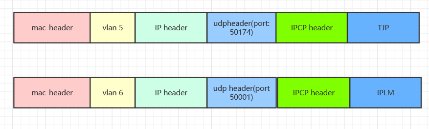
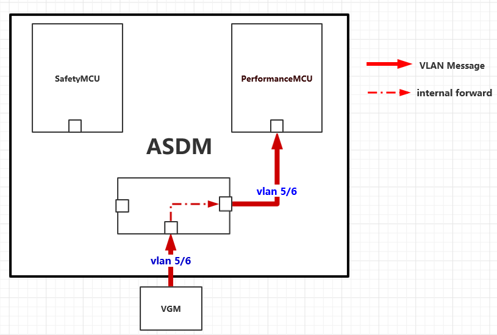
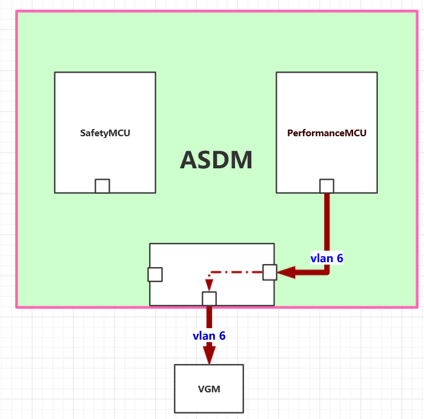
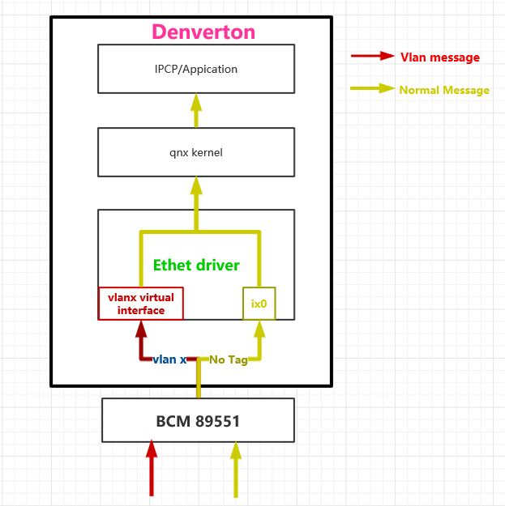
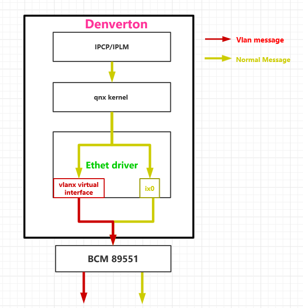

= Vlan implement

:toc:
:toclevels: 4
:toc-position: left
:source-highlighter: pygments
:icons: font
:sectnums:

== vlan distribution in ASDM

* According the requirement,Vlan tables on ASDM as below:

,===

vlan ID,node name,function

5,VGM-ASDM,Traffic Jam Pilot
6,VGM-ASDM,IPLM

,===

.Vlan message as below

== vlan message forward information

=== ASDM receive IPCP/IPLM messages

=== ASDM send IPCP/IPLM messages

== Denverton internal implement

=== Denverton receive  messages

=== denverton send messages

