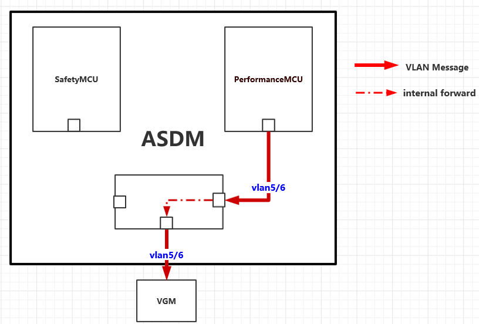

= Vlan implement

:toc:
:toclevels: 4
:toc-position: left
:source-highlighter: pygments
:icons: font
:sectnums:

== vlan distribution in ASDM

* According the requirement,Vlan tables on ASDM as below:

,===

vlan ID,node name,function

5,VGM-ASDM,Traffic Jam Pilot
6,VGM-ASDM,IPLM

,===

.Vlan message as below

== vlan message forward information

=== ASDM receive IPCP/IPLM messages

image:image/vlan2.png[image,600,600,role="center"]

=== ASDM send IPCP/IPLM messages

== Denverton internal implement

=== Denverton receive  messages

=== denverton send messages

image:image/vlan_den4.png[image,600,600,role="center"]

== implement on qnx software

=== driver

For implement vlan ,I will create two virtual interfaces on denverton.

interface "vlan0" for receive and send packet with vlan ID 5.
interface "vlan1" for receive and send packet with vlan ID 6.

like below:

=== IPCP

==== implement

Need the socket bind the interface "vlan0", Then the TJP messages which take the vlan tag 5 will be

listen by IPCP directly.

We can bind specific network interface use "setsockopt()" function.

About setsockopt,you can click : link:http://www.qnx.com/developers/docs/7.0.0/index.html#com.qnx.doc.neutrino.lib_ref/topic/s/setsockopt.html[setsockopt]

==== demo

[source,c]

....
#define INTERFAXENAME "vlan0"

struct ifreq interface;

strncpy(interface.ifr_ifrn.ifrn_name, INTERFAXENAME, sizeof(INTERFAXENAME));
if (setsockopt(sock, SOL_SOCKET, SO_BINDTODEVICE, (char *)&interface, sizeof(interface))  < 0)
 {
    perror("SO_BINDTODEVICE failed");
 }
....
