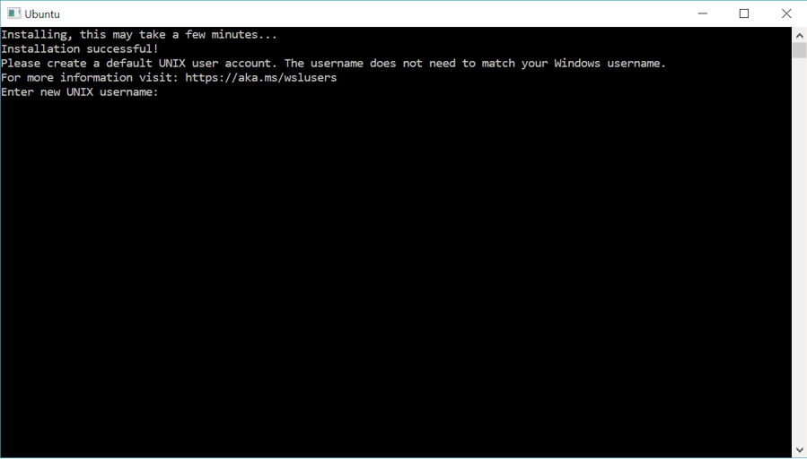

= WSL在win10下的安装使用
认真
:toc:
:toclevels: 4
:toc-position: left
:source-highlighter: pygments
:icons: font
:sectnums:

== WSL是什么

TIP: 我们想在windows上学习linux,最好需要一个linux环境，通常做法是安装虚拟机。
无论是Vmware 还是 Vbox 等等虚拟机，都需要额外占有大量资源，切需要一直维持虚拟机
运行，性价比不高。

* WSL是微软专门为了在windows上提供一套类linux系统开发的，可以基于自身系统天然安装。
安装后的感觉，就好像在windows上安装了一个服务一样，随时随地轻量级打开，非常简洁，高效。
我觉得是入门Linux的最好选择。

== WSL安装步骤

* 打开电脑，控制面板 -> 程序 -> 启用或关闭 Windows 功能 -> 勾选 适用Linux的Windows子系统

** 

* 然后需要重启一下你的电脑

* 重启电脑之后，打开微软商店(在左下角搜素里输入：Microsoft store),然后在微软商店里搜索:ubuntu
然后选择 Ubuntu 18.04安装即可。非常方便。
** 

* 安装完成后，打开即可。打开后，会让你设置同户名和密码。自己设置即可。
** 

* 安装后的ubuntu就在开始菜单里
** 

* 打开后的大概是这个样子
** 

== WSL简单设置

* 因为经常需要超级权限，所以打开后最好设置下root权限

** 打开ubuntu，然后输入  sudo passwd root.会让你输入密码，输入即可。

== 大功告成

 * 这样，用最小的资源就可以实现在windows上自由使用Linux环境的东西。vim/shell 学习Linux入门。
 git/Makefile等等，统统没问题。

 * 这是我发现的最好的最轻量级别的方法。分享出来。
