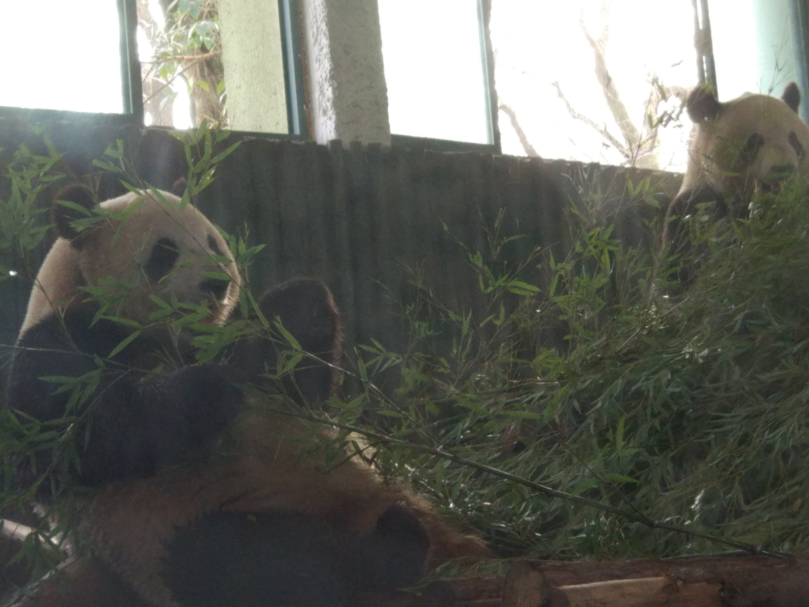
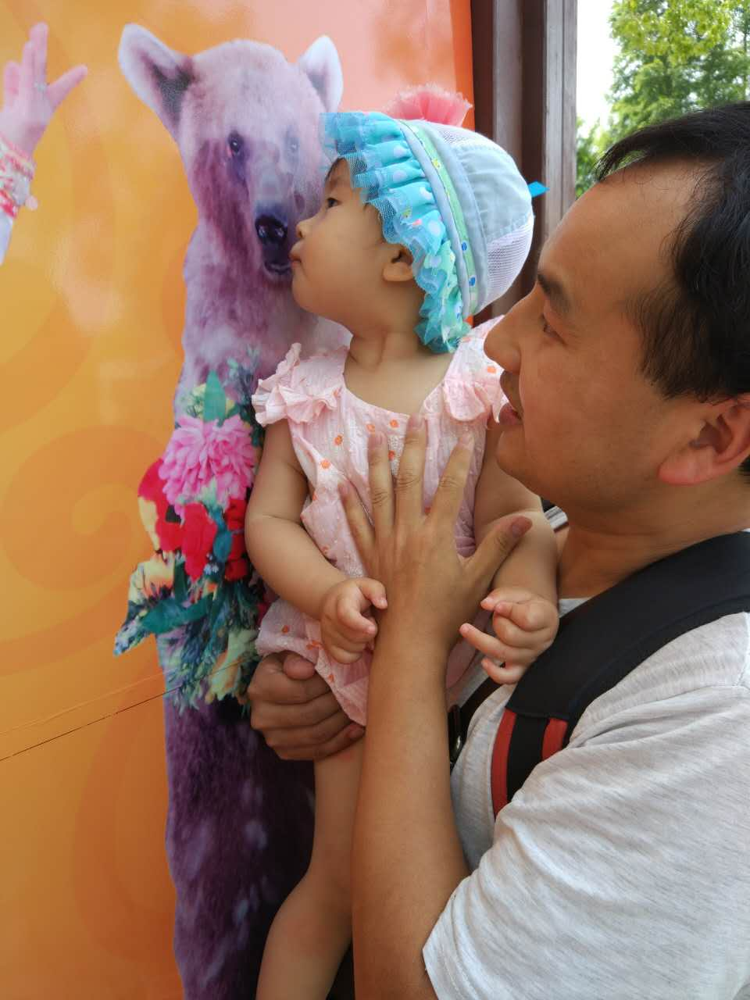
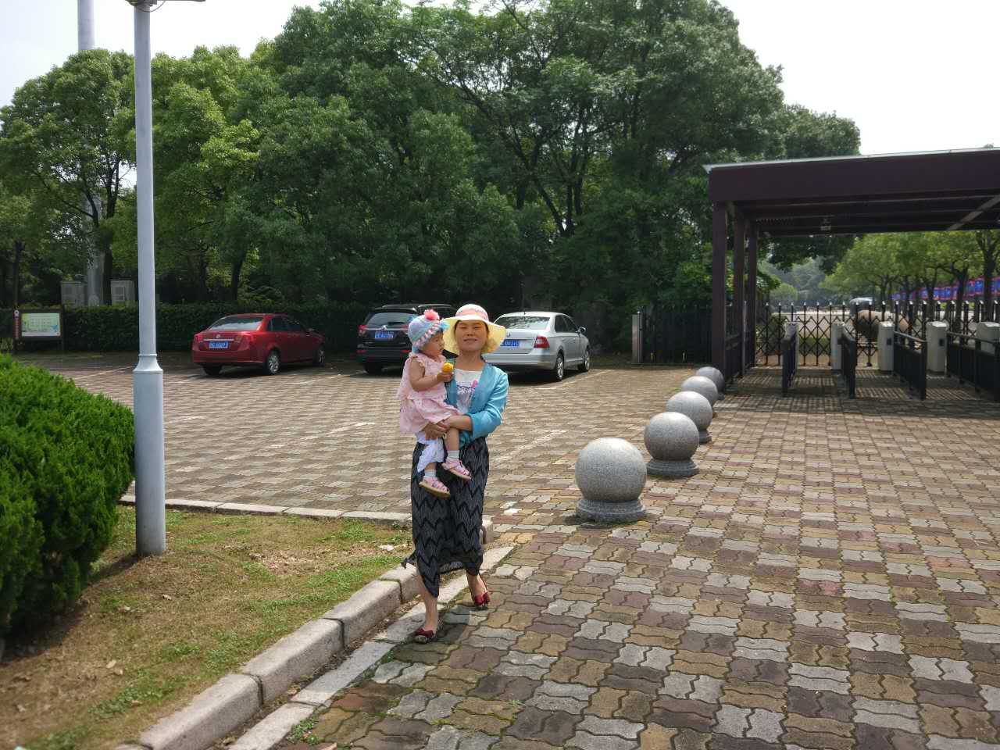

= 亲子时光
开心成长
:toc:
:toclevels: 4
:toc-position: left
:source-highlighter: pygments
:icons: font
:sectnums:

== 上海动物园游玩

* 时间：2016年3月
* 年龄：年年一岁半
* 人物：和啊坤家一起

TIP: 动物园之行当天天气实在是非行热，穿的毛衣什么的简直蒸的难受.
入园可以租用免费的婴儿推车，可惜，我家年年根本不喜欢任何束缚她自己的东西,
更别提推车了，所以全程我老婆抱着，那个辛苦啊

* 可爱的熊猫

image:image/tr_2.jpg[image,600,600,role="center"]

== 上海野生动物园游玩

* 时间：2016年6月
* 年龄：年年一岁九个月
* 人物：公司组织

TIP: 野生动物园总体来说，动物分布更广，里面有很多表演，按照不同的时间段可以看。
野生动物园里有电动车，带孩子的话，一定要选择，因为凭票可以随时下车，上车。

* 留念照片如下：

