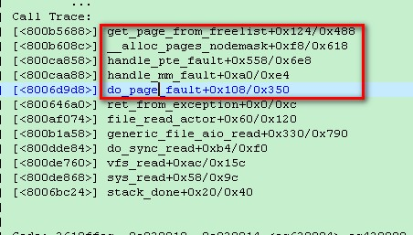
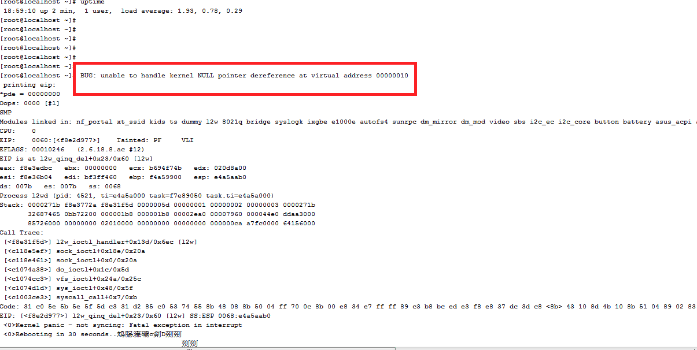

= AP排查问题技术总结
haodongdong
:toc:
:toclevels: 4
:toc-position: left
:source-highlighter: pygments
:icons: font
:sectnums:

== PING包不通问题

TIP: AP 不通问题要跟据实际情况实际排查，文中思路只是经验排查

* 常见排除原因
** 查看网口状态，是否是正常UP/RUNNING状态
** 检查协商速率，是否正常。通常，百兆网口的AP直接连接千兆口设备比如AC，会出现不通，需要用千兆POE或者交换机中转一下.
** 单通情况，首先排除电脑端的防火墙设置，由于各种防火墙存在，以及杀毒软件，可能导致单通情况。关闭后，依然出现单通，检查AP上配置是否有 +
   filter配置。检查命令如下： 
*** iptables -L
*** ebtales -L
*** 清除命令：iptables -F
** 以上情况都排除以后，只有抓包来确认报文不通位置
***  *ap上抓包有接收到报文和响应报文，PC上没有收到*
**** 确认转发状态设置正常 'cat /proc/sys/net/ipv4/ip_forward' 是否为1，如果不等于1，则置1
**** 'cat /sys/class/net/eth0/statistics/tx_bytes/rx_bytes' 查看状态，确认流量正常，PC端抓包，排除AP驱动问题.
** 其他手段

== AP重启问题排查总结

=== 重启种类

TIP: 重启种类：正常重启和异常重启，本文主要讨论异常重启 

. 异常重启：
.. 用户层异常调用reboot，这种重启AP会记录重启原因，一般根据重启原因找到相对应的代码块位置即可找到问题，解决问题
.. 内核态重启：看门狗重启和堆栈重启

=== 用户态异常重启

* 看reboot重启原因，根据原因打印找到相对应代码模块
* 看LOG打印，根据LOG打印，可以定位到相应的模块
* 其他方法

=== 内核态重启
====  看门狗重启
* 看门狗原理介绍
** 简单介绍
+
****

看门狗,又叫 watchdog timer,是一个定时器电路, 一般有一个输入,叫喂狗,一个输出到MCU的RST端,MCU正常工作的时候,每隔一端时间输出一个
信号到喂狗端,给 WDT 清零,如果超过规定的时间不喂狗,(一般在程序跑飞时),WDT 定时超过,就回给出一个复位信号到MCU,是MCU复位. 防止MCU
死机. 看门狗的作用就是防止程序发生死循环，或者说程序跑飞

****
+
** 详细原理介绍

*** #请点击这里#  link:http://ksffj6eu.blog.163.com/blog/static/9259276720087277487482/[看门狗原理介绍]

* 看门狗重启常见原因
** 大流量导致的CPU繁忙，没有多余精力调度喂狗进程，造成狗饿死，重启系统
** 死锁或者死循环造成的系统僵死，某个进程无限占用CPU，造成喂狗进程饿死，从而无法喂狗，重启

==== 堆栈重启
. linux kernel panic产生原因
+
****
panic是英文中是惊慌的意思，Linux Kernel panic正如其名，linux kernel不知道如何走了，它会尽可能把它此时能获取的全部信息都打印出来。
有两种主要类型kernel panic +

<1> hard panic(也就是Aieee信息输出)
<2> soft panic(也就是Oops信息输出)

****
+
. 常见引发内核堆栈的行为

****
<1> 内存重复释放，出现double free时，通常是由于这种情况所致。
<2> 内存泄露，分配的内存忘了释放。
<3> 内存越界使用，使用了不该使用的内存。
<4> 使用了无效指针。
<5> 空指针，对一个空指针进行操作。
****
=== AP内核堆栈排查思路

NOTE: 排查思路只是平时工作中遇到问题，解决问题后的一些个人总结，带有很大的经验主义
所以仅供参考，请勿遇到问题时候对号入座。每个问题产生的背景都不一样，但是本质都是相同的，
增加自己的知识储备非常重要。

==== 内存泄漏问题

* 判断内存泄漏依据
** 看堆栈，发现有内存不足的打印
** 定时查看 #free# 发现持续减少，不会恢复
** #cat /proc/meminfo# 发现可用内存一直在减少
** #cat /proc/slabinfo# 可以看出slab中一些内存块增加速度非常快

* 常见内存泄漏原因
** 内核中kmalloc申请来很多内存块，代码free流程中释放不当，或者忘记释放，会造成内存泄漏
** 申请释放所使用的函数不一致，导致无效释放内存造成内存泄漏
*** 典型例子1：申请skb 调用 #dev_kmalloc_skb()#, 但是释放skb处却调用来 kfree_skb,造成不断申请的skb buff，无法正常释放，最后内存耗尽，堆栈死机
*** 典型例子2：释放skb调用 #kfree()# ,同样造成来内存泄漏.
*** 典型例子3：内核中某些报文流程处理后，没有及时释放SKB。比如，数据面自己封装完SKB后调用SOCKET发送，发送完成后，忘记释放SKB
* 贴上一个内存泄漏的堆栈 +

==== double free问题
==== 空指针问题

* 定位为空指针依据
** 出现堆栈打印
** 且堆栈打印中有出现NULL porinter字样
** 每次堆栈信息不变，而且几乎必现
* 堆栈如下图所示 +

==== 非法地址访问
==== 内存不足页表映射错误
==== 死锁

. 堆栈问题排查思路总结
** 根据堆栈判断原因
** 根据堆栈定位模块
** 根据堆栈寄存器位置，利用OBJDUMP 反汇编找出堆栈位置
*** OBJDUMP使用方法
***  内存问题总结
