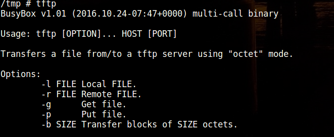
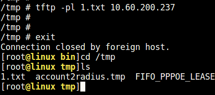

= AP获取和上传文件方法总结
haodongdong
:toc:
:toclevels: 4
:toc-position: left
:source-highlighter: pygments
:icons: font
:sectnums:

TIP: 该文档总结了AP和不同设备之间上传或者下载文件的所有方法。

== 已知的所有方法

. tftp
. nc
. ftpX
. ftpget

=== 各种方法使用详细总结

* tftp
. PC端和AP

　AP上默认开启了tftp服务，PC端需要下载第三方的tftp客户端即可。
在AP上敲打tftp命令，看到的帮助信息如图所示。

.. 使用举例

AP上获取文件 <1> cd /tmp <2> tftp -gl /tmp/xxx x.x.x.x(PC端地址)

... AC与AP

<1> 进入AC的 #/usr/local/ac/bin# 目录下，然后启动tftp服务：　./tftpd
<2> 然后以AP侧操作为例，AP向AC传一个文件xxx

tftp -pl xxx x.x.x.x(AC地址)   如下图所示：

