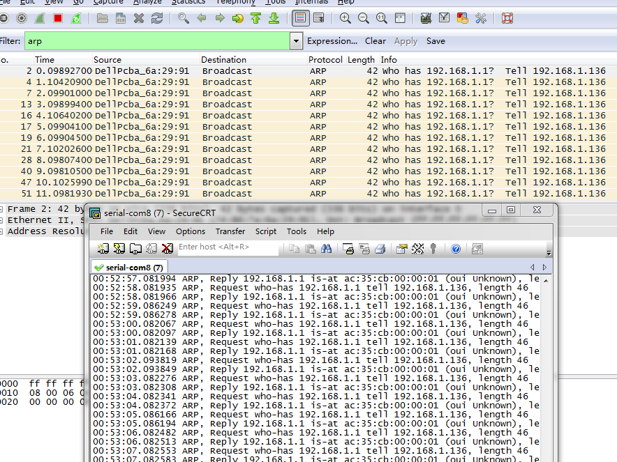

= 工作内容
认真
:toc:
:toclevels: 4
:toc-position: left
:source-highlighter: pygments
:icons: font
:sectnums:

== 5-5工作记录

. 完成环境配置
. 查看ap堆栈
- [*] 配置

== 5-6工作记录

.今日计划

****

- [*] 完成ac侧上行广播错误合入
- [*] 完成ap堆栈初步排查
- [*] 验证老版本ap集中转发问题，无线终端拿不到地址问题

****
* 验证结论：11AC设备老版本问题依旧，目前修改AC侧代码，优化集中转发数据面流程。

== 5-9工作记录

.今日计划（延迟）

****

* 准备排查AP侧白名单命令调用引发堆栈问题，该问题分解计划如下：
- [ ] 复现该问题，用TA4025/TA40/AP93
- [ ] 确认是否git-lab代码新引入的问题，作比对测试，新旧代码
- [ ] 走读白名单底层流程代码，初步判断怀疑点
- [ ] 修改怀疑点，验证问题，自测

****

.今日实际计划

****

* 排查ta62设备ftp上传速率过慢问题
- [*] 用ta4025/ta2025ac 搭建ftp环境，两台笔记本，搭建环境（预计1小时）
- [*] 先用最新版本验证上传下载，看结果是否有问题
- [ ] 换用老版本2.5.1.7对比测试
- [ ] 根据测试结果，得到结论

****

.今日完成

****
. 实际搭建了测试环境，ftp服务器，客户端，ap
. 测试了ftp上传下载，发现速率只有1.2MB,问找灿，可能和环境有关需要重新打流才可以确认
. 搭建打流环境，ix打流，目前进行中。
****
== 5-10工作记录

.今日计划

****
- [*] ta62平台上用ix打流，用所得结果再次和ftp上传下载做比较，排除无线问题
- [*] 用ta40/ta98平台做对比验证，排除11ac设备问题
- [*] 根据所测试结果得出结论，确定问题方向

****
. *结论* ap下载速率有问题
. 待验证是否涉及问题？配置问题？

== 5-11工作记录

.今日计划

****
- [*] ta98做最后验证--验证同样问题
- [*] 根据测试数据结论排查ap侧配置，确认流控/tcp 流程是否有代码限制
- [*] 修改有关参数，再次打流验证

****
.结论

*之前测试ftp下载软件服务端和客户端不配套，导致流量很低*

== 5-12工作记录

.今日计划

****
- [ ] 已经验证ta98,ta62,ta55,ta40 ftp上传下载，ix打流，均正常,赵灿建议必须测一下11ac的性能和ftp下载，由于需要专门的11ac电脑，今日申请进行
- [ ] 写文档：ap侧打流使用说明，方便其他人参考
- [ ] 项目侧其它安排

****
== 5-13工作记录

.今日计划

****
- [*] 确认问题，根据无线指标让无线侧关注
- [*] 查看ap模块流程
- [*] 搭建本地环境，准备排查打流堆栈问题

****
== 5-16工作记录

.今日计划

****
- [*] 借测试手机，搭建打流环境
- [*] 打集中转发上下行流，观察内存以及cpu情况
- [ ] 新旧版本
****
* 结论：用了ta98和ta62打流4小时，未重启，集中加密打流

== 5-17工作记录

.今日计划

****
- [*] 八楼打流，复现问题，排查复现条件
- [*] 打所有ap

****
* 结论：较难复现

== 5-18工作记录

.今日计划

****
- [*] 继续八楼打流，增加压力测试条件
- [*] 根据出现异常结果判断重启原因
- [ ] 用testcenter构造超大流量，冲击集中转发

****
NOTE: 结论：无法复现，暂时搁浅

== 5-19工作记录

.今日计划
****
- [*] 搭建稳定性环境
- [*] 打流复现，已经完成

****
NOTE: 打流问题可以暂时放置，稳定性环境已经搭建完成。

== 5-20工作记录

.今日计划
****
- [*] 复现ta58百兆网口不通问题
- [ ] 总结ap重启问题文档
- { } 总结

****
.状态
,===

打流,结论
ftp,无法复现
集中转发,无法复现

,===

== 5-23工作记录

.今日计划
****
- [*] ta58网口驱动问题再一次验证，主要验证交换机供电情况，是否有异常？
- [ ] 文档总结，不通和堆栈问题

****
TIP: ta58驱动问题，测试下来，应该也是不好复现的，没有专门的测试用例，靠经验复现 +
交换机没有问题

IMPORTANT: 普通ap的测试条件，胖版本是否存在该问题，需要确认 

== 5-24工作记录
.今日计划
****
- [ ] ta58网口不通问题排查
- [ ] 文档总结，不通和堆栈问题

****

. ta58网口不通问题复现条件
* [red]#百兆交换机#连接ta58与pc +
* ta58启动正常后，pc上先清除所有arp，连接pc的网口 +
* pc向ta58 ping包 +
. 抓包排查结果 +
* AP上抓包，发现收到pc端的arp request报文，也有响应arp报文发出 +
* pc上抓包，仅仅有arp请求报文 +
. 抓包情况如下 +

IMPORTANT: 该问题请求研发一部同事也给予帮助意见，应该是驱动有问题

