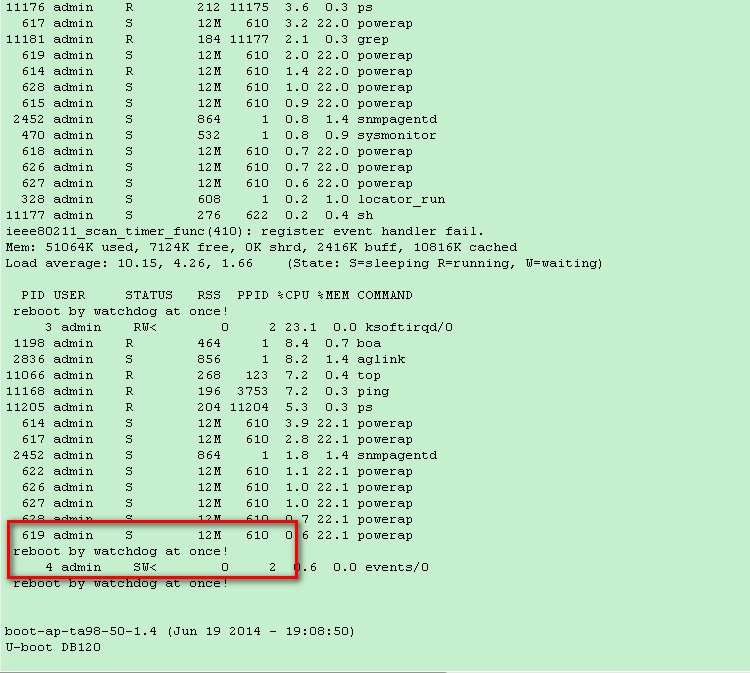
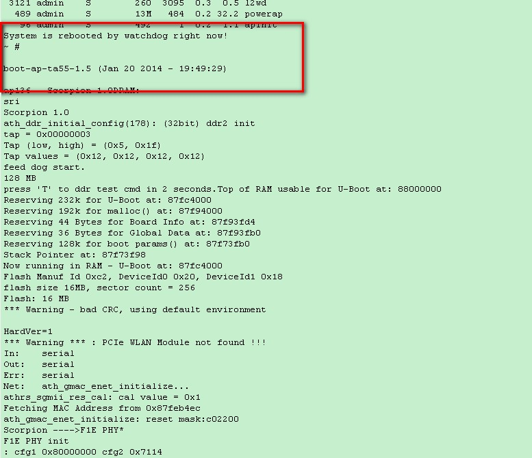
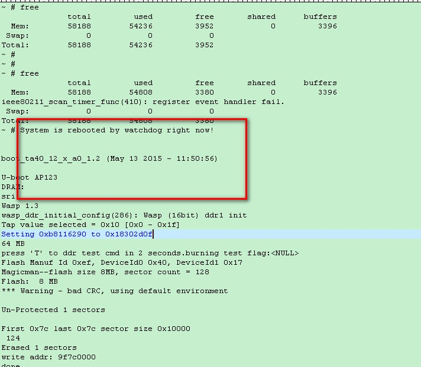

= 工作内容
认真
:toc:
:toclevels: 4
:toc-position: left
:source-highlighter: pygments
:icons: font
:sectnums:

== 7-1工作记录

TIP: 排查打流引起的堆栈问题

.今日计划
****
- [*] 排查打流堆栈问题，配合测试人员排查
- [*] 查看打流堆栈信息，初步判断所属问题定位
- [ ] 修改代码
- [ ] 测试
****

* [red]#__**结论如下**__# ：
** WA2020属于 #watchdog重启#
** AP93属于老问题，当时结论是内核访问内存方式有问题，弱解决状态
** OA2025AC 很大可能属于硬件问题，更换设备后打流政策

== 7-4工作记录

TIP: 堆栈问题排查

* 排查
****
- [*] 查看常庆国发的log文件，分类整理
- [*] 根据log信息确认定位问题
- [ ] 结论
****

* 结论

** 有问题的AP和对应原因

*** TA2025 如下图

*** TA3025如下图

*** CA1020如下图

image:image/ca1020.jpg[image.600.600.role="center"]

*** WA2020如下图

*** TA2025AC如下图

image:image/ta2025ac.jpg[image.600.600.role="center"]

* 已完成
- [*] WA2020/CA1020/TA3025合入内存门限机制
- [*] TA2025AC 属于偶像，且换设备后无法复现，无法确认是否软件问题

